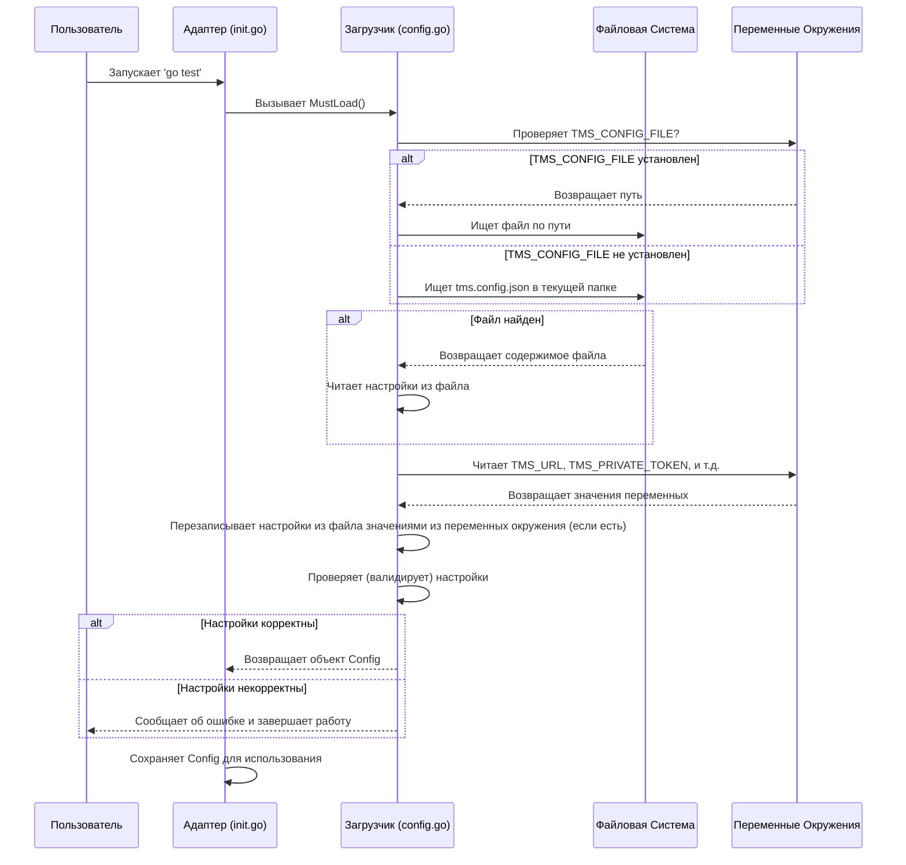

# Chapter 1: Конфигурация Адаптера


Добро пожаловать в мир `adapters-go`! Это первая глава нашего путешествия, и начнем мы с самого основного — конфигурации.

Представьте, что адаптер — это ваш телефон, а Test IT TMS — это Wi-Fi сеть, к которой вы хотите подключиться. Чтобы телефон мог выйти в интернет через Wi-Fi, ему нужны **настройки**: имя сети (SSID), пароль, а иногда и другие параметры. Точно так же и нашему адаптеру нужны инструкции, чтобы "понять", как подключиться к вашему экземпляру Test IT и куда отправлять результаты тестов. Без этих настроек адаптер просто не сможет работать.

В этой главе мы разберемся:

*   Что такое конфигурация адаптера?
*   Какие параметры нужны для работы?
*   Как передать эти параметры адаптеру?

## Зачем нужна конфигурация?

Основная задача адаптера `adapters-go` — отправлять результаты ваших автоматических тестов, написанных на Go, в систему управления тестированием Test IT TMS. Чтобы он мог это сделать, ему нужно знать как минимум:

1.  **Куда подключаться?** (Адрес вашего Test IT)
2.  **Как авторизоваться?** (Секретный ключ доступа)
3.  **В какой проект и конфигурацию отправлять данные?** (Идентификаторы вашего проекта и конфигурации в Test IT)

Вся эта информация и составляет **конфигурацию адаптера**.

## Способы задания конфигурации

Есть два основных способа передать настройки адаптеру:

1.  **Файл конфигурации `tms.config.json`**: Специальный файл в формате JSON, который лежит в вашем проекте.
2.  **Переменные окружения**: Системные переменные, которые можно задать перед запуском тестов.

Адаптер спроектирован так, чтобы сначала искать настройки в файле, а затем проверять переменные окружения. **Значения из переменных окружения всегда имеют приоритет** и перезапишут значения из файла, если они заданы и там, и там.

### 1. Файл `tms.config.json`

Самый простой способ — создать файл с именем `tms.config.json` в корне вашего проекта или в директории с тестами.

Вот минимальный пример содержимого этого файла:

```json
// Файл: tms.config.json
{
  "url": "https://<ваш_домен_testit>",
  "privateToken": "ВашОченьСекретныйТокен",
  "projectId": "ID_вашего_проекта_UUID",
  "configurationId": "ID_вашей_конфигурации_UUID",
  "testRunId": "ID_тест_рана_UUID", // Обязателен для некоторых режимов
  "adapterMode": "0" // Режим работы адаптера
}
```

**Объяснение:**

*   `url`: Адрес вашего сервера Test IT.
*   `privateToken`: Ваш личный API токен для доступа к Test IT (его можно сгенерировать в профиле пользователя Test IT). **Важно: держите его в секрете!**
*   `projectId`: Уникальный идентификатор (UUID) проекта в Test IT, куда будут отправляться результаты.
*   `configurationId`: Уникальный идентификатор (UUID) конфигурации тестов внутри проекта.
*   `testRunId`: Идентификатор (UUID) конкретного тест-рана (запуска тестов), в который будут добавлены результаты. Этот параметр не всегда обязателен (зависит от `adapterMode`).
*   `adapterMode`: Определяет, как адаптер будет работать с тест-ранами (подробнее чуть ниже).

Вы можете добавить и другие параметры, если нужно (мы их рассмотрим):

```json
{
  "url": "URL",
  "privateToken": "USER_PRIVATE_TOKEN",
  "projectId": "PROJECT_ID",
  "configurationId": "CONFIGURATION_ID",
  "testRunId": "TEST_RUN_ID",
  "adapterMode": "1", // Режим 1: отправлять все результаты без фильтрации
  "automaticCreationTestCases": false, // Автоматически создавать тест-кейсы? (опционально)
  "certValidation": true, // Проверять SSL сертификат? (опционально)
  "isDebug": false // Включить подробное логирование? (опционально)
}
```

**Где разместить файл?**

Адаптер будет искать `tms.config.json` в текущей рабочей директории, откуда запускаются тесты. Если у вас сложная структура проекта, вы можете явно указать путь к файлу через переменную окружения `TMS_CONFIG_FILE`.

### 2. Переменные окружения

Вместо файла (или в дополнение к нему) вы можете использовать переменные окружения. Это особенно удобно в системах непрерывной интеграции (CI/CD).

Вот основные переменные окружения, соответствующие параметрам в JSON файле:

| Описание                                      | Переменная Окружения  | Свойство в файле   |
| :-------------------------------------------- | :-------------------- | :----------------- |
| Адрес экземпляра TMS                          | `TMS_URL`             | `url`              |
| Приватный API токен                           | `TMS_PRIVATE_TOKEN`   | `privateToken`     |
| ID проекта в TMS                              | `TMS_PROJECT_ID`      | `projectId`        |
| ID конфигурации в TMS                         | `TMS_CONFIGURATION_ID`| `configurationId`  |
| ID тест-рана (если используется)              | `TMS_TEST_RUN_ID`     | `testRunId`        |
| Режим работы адаптера (0, 1 или 2)           | `TMS_ADAPTER_MODE`    | `adapterMode`      |
| Проверка SSL сертификата (true/false)         | `TMS_CERT_VALIDATION` | `certValidation`   |
| Автоматическое создание тест-кейсов (true/false) | `TMS_AUTOMATIC_CREATION_TEST_CASES` | `automaticCreationTestCases` |
| Включить режим отладки (true/false)           | `TMS_IS_DEBUG`        | `isDebug`          |
| Путь к файлу конфигурации                     | `TMS_CONFIG_FILE`     | \-                 |

**Пример использования переменных окружения (в Linux/macOS):**

```bash
# Устанавливаем переменные окружения
export TMS_URL="https://<ваш_домен_testit>"
export TMS_PRIVATE_TOKEN="ВашОченьСекретныйТокен"
export TMS_PROJECT_ID="ID_вашего_проекта_UUID"
export TMS_CONFIGURATION_ID="ID_вашей_конфигурации_UUID"
export TMS_TEST_RUN_ID="ID_тест_рана_UUID"
export TMS_ADAPTER_MODE="0"

# Запускаем тесты
go test ./...
```

Если вы установите `TMS_URL`, то значение `url` из файла `tms.config.json` будет проигнорировано.

## Ключевые параметры конфигурации

Давайте кратко пробежимся по самым важным настройкам:

*   **`url`, `privateToken`, `projectId`, `configurationId`**: Это "святая троица" – без них адаптер не сможет подключиться и отправить результаты в нужное место. Получить `projectId` и `configurationId` можно из интерфейса Test IT (обычно из URL страницы проекта/конфигурации). Токен генерируется в настройках профиля пользователя.

*   **`testRunId`**: Если вы хотите добавлять результаты к уже существующему тест-рану, вам нужно указать его ID здесь. Это часто используется в CI/CD, где тест-ран создается заранее.

*   **`adapterMode`**: Определяет логику работы адаптера:
    *   `"0"` (по умолчанию): Адаптер будет запускать только те тесты, которые указаны в тест-ране (`testRunId`), и отправлять результаты в этот же тест-ран. Тесты фильтруются по `testRunId` и `configurationId`.
    *   `"1"`: Адаптер запускает тесты (возможно, с фильтрацией на уровне `go test`) и отправляет *все* результаты в указанный `testRunId` без дополнительной фильтрации со стороны адаптера.
    *   `"2"`: Адаптер *автоматически создает новый тест-ран* в Test IT перед запуском тестов, использует его ID для отправки результатов и, как правило, завершает его после окончания тестов (если используется CLI Test IT). `testRunId` в конфигурации при этом режиме не нужен (он будет сгенерирован).

*   **`automaticCreationTestCases`** (опционально, `false` по умолчанию): Если `true`, адаптер будет пытаться создать новый тест-кейс в Test IT для каждого автотеста, у которого еще нет связи с тест-кейсом.

*   **`certValidation`** (опционально, `true` по умолчанию): Управляет проверкой SSL сертификата сервера Test IT. Устанавливайте в `false` только для тестовых окружений с самоподписанными сертификатами (не рекомендуется для producción).

*   **`isDebug`** (опционально, `false` по умолчанию): Если `true`, адаптер будет выводить в консоль гораздо больше информации о своей работе, что полезно для отладки.

## Как адаптер загружает конфигурацию?

Когда вы запускаете тесты с `adapters-go`, происходит примерно следующее (очень упрощенно):

1.  **Инициализация:** До выполнения ваших тестов запускается специальная функция `init()` в пакете адаптера (`init.go`).
2.  **Поиск файла:** Внутри `init()` вызывается функция `config.MustLoad()`. Эта функция сначала проверяет, установлена ли переменная окружения `TMS_CONFIG_FILE`.
    *   Если да, она использует указанный путь.
    *   Если нет, она ищет файл `tms.config.json` в текущей рабочей директории.
3.  **Чтение файла:** Если файл найден, его содержимое считывается и разбирается (парсится).
4.  **Чтение переменных окружения:** Затем функция проверяет наличие всех известных переменных окружения (`TMS_URL`, `TMS_PRIVATE_TOKEN` и т.д.).
5.  **Перезапись значений:** Если какая-то переменная окружения установлена, ее значение *перезаписывает* соответствующее значение, прочитанное из файла.
6.  **Валидация:** Проверяется корректность обязательных параметров (например, что `url` похож на URL, а ID имеют формат UUID). Если что-то не так, программа остановится с ошибкой.
7.  **Готово:** Загруженная и проверенная конфигурация сохраняется для дальнейшего использования адаптером.

Вот как это можно представить в виде диаграммы:



За кулисами используется библиотека `cleanenv`, которая упрощает чтение конфигурации из файлов и переменных окружения. Основная логика загрузки находится в файле `config/config.go` в функции `MustLoad`.

```go
// Упрощенный пример из config/config.go
package config

import (
    "log"
    "os"
    "path/filepath"
    "github.com/ilyakaznacheev/cleanenv"
)

// ... (структура Config остается той же) ...

func MustLoad() *Config {
    // 1. Определяем путь к файлу конфигурации
    configPath := os.Getenv("TMS_CONFIG_FILE")
    if configPath == "" {
        // Если переменная не задана, ищем в текущей директории
        cwd, _ := os.Getwd()
        configPath = filepath.Join(cwd, "tms.config.json")
        // Проверяем, существует ли файл (упрощено)
    }

    var cfg Config // Создаем пустую структуру для настроек

    // 2. Читаем из файла (если он есть)
    if _, err := os.Stat(configPath); err == nil {
        err := cleanenv.ReadConfig(configPath, &cfg)
        if err != nil {
            log.Fatalf("Ошибка чтения файла конфигурации: %s", err)
        }
    }

    // 3. Читаем из переменных окружения (и перезаписываем значения из файла)
    err := cleanenv.UpdateEnv(&cfg)
    if err != nil {
        log.Fatalf("Ошибка обновления из переменных окружения: %s", err)
    }

    // 4. Проверяем корректность значений
    validateConfig(cfg) // Функция для проверки URL, UUID и т.д.

    return &cfg // Возвращаем готовую конфигурацию
}

// ... (функция validateConfig для проверки) ...
```

Эта загруженная конфигурация затем используется для инициализации клиента Test IT (подробнее о нем в главе [Клиент Test IT](08_клиент_test_it_.md)), который и будет выполнять всю работу по отправке данных.

```go
// Фрагмент из init.go
package tms

// ... импорты ...

var (
    cfg    *config.Config // Здесь будет храниться загруженная конфигурация
    client *tmsClient     // Клиент для общения с Test IT API
    // ... другие переменные ...
)

func init() {
    // 1. Загружаем конфигурацию при старте пакета
    cfg = config.MustLoad()
    // ... настройка логирования ...

    // 2. Создаем клиент Test IT с использованием загруженной конфигурации
    client = newClient(*cfg)

    // 3. Если режим = 2, создаем тест-ран автоматически
    if cfg.AdapterMode == "2" {
        callCreateTestRun(client, cfg) // Создает тест-ран и обновляет cfg.TestRunId
    }
    // ... другая инициализация ...
}
```

## Заключение

Мы разобрались, что конфигурация — это набор инструкций для адаптера `adapters-go`, которые говорят ему, куда и как подключаться к Test IT TMS. Мы узнали, что настройки можно задавать через файл `tms.config.json` или переменные окружения, причем переменные окружения имеют приоритет. Мы также рассмотрели основные параметры конфигурации, такие как URL, токен, ID проекта и режим работы.

Понимание того, как работает конфигурация, — это первый и очень важный шаг. Теперь, когда наш адаптер знает, как связаться с Test IT, мы можем перейти к следующему этапу: как сообщить адаптеру о начале и конце теста и как добавить к нему основную информацию (метаданные).

Об этом мы поговорим в следующей главе: [Запуск Теста и Метаданные](02_запуск_теста_и_метаданные_.md).

---

Generated by [AI Codebase Knowledge Builder](https://github.com/The-Pocket/Tutorial-Codebase-Knowledge)