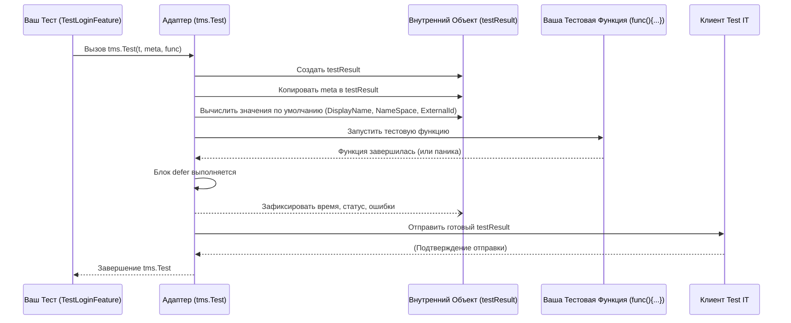

# Chapter 2: Запуск Теста и Метаданные


Привет! В [предыдущей главе](01_конфигурация_адаптера_.md) мы настроили наш "телефон" — адаптер, чтобы он знал, как связаться с "Wi-Fi сетью" Test IT TMS. Теперь, когда связь установлена, пора сделать первый "звонок" — запустить наш автотест и рассказать о нем системе Test IT.

Представьте, что вы готовитесь провести научный эксперимент. Прежде чем начать, вы заполняете **анкету**:
*   **Название эксперимента:** "Проверка кипения воды при 100°C"
*   **Цель:** Подтвердить температуру кипения.
*   **Связанные документы:** Ссылка на учебник физики (ID документа: #123)
*   **Ключевые слова:** "вода", "кипение", "физика"
*   **Уникальный номер:** EXP-001

Затем вы проводите сам эксперимент (нагреваете воду и измеряете температуру).

В мире `adapters-go` функция `tms.Test` и структура `TestMetadata` играют роль этой анкеты и запуска эксперимента. `TestMetadata` — это ваша анкета, а `tms.Test` — это процесс, который берет эту анкету, запускает ваш тест (эксперимент) и отправляет результаты вместе с данными из анкеты в Test IT.

В этой главе мы узнаем:
*   Что такое функция `tms.Test`?
*   Что такое Метаданные (`TestMetadata`) и зачем они нужны?
*   Как запустить простой тест с использованием адаптера?

## Функция `tms.Test`: Сердце интеграции

В обычном Go-тестировании вы пишете функции вида `func TestMyFunction(t *testing.T) { ... }`. Адаптер `adapters-go` просит вас немного изменить эту структуру. Вместо прямого написания логики теста внутри `TestMyFunction`, вы оборачиваете ее в специальную функцию `tms.Test`.

```go
package examples

import (
	"testing"
	"github.com/testit-tms/adapters-go" // Не забудьте импортировать адаптер
)

func TestSimpleSuccess(t *testing.T) {
    // 1. Определяем метаданные (наша "анкета")
    meta := tms.TestMetadata{
        DisplayName: "Мой Первый Успешный Тест с Адаптером",
        Description: "Проверяем, что 1 + 1 = 2",
        WorkItemIds: []string{"PROJECT-T-1"}, // Связь с ручным тестом в Test IT
        Labels:      []string{"простой", "арифметика"},
    }

    // 2. Запускаем тест через tms.Test
    tms.Test(t, meta, func() {
        // 3. Ваша обычная логика теста идет здесь
        t.Log("Начинаем проверку сложения...")
        result := 1 + 1
        expected := 2
        if result != expected {
            t.Errorf("Ожидали %d, получили %d", expected, result)
        }
        t.Log("Проверка сложения завершена.")
    })
}
```

Давайте разберем этот пример:

1.  **`import "github.com/testit-tms/adapters-go"`**: Мы подключаем пакет адаптера.
2.  **`meta := tms.TestMetadata{...}`**: Мы создаем переменную `meta` типа `tms.TestMetadata`. Это и есть наша "анкета", где мы описываем тест для Test IT.
3.  **`tms.Test(t, meta, func() { ... })`**: Это главная функция адаптера для запуска теста.
    *   Первый аргумент (`t`) — это стандартный объект `*testing.T`, который вы всегда используете в Go-тестах.
    *   Второй аргумент (`meta`) — это наша заполненная "анкета" с метаданными.
    *   Третий аргумент — это анонимная функция `func() { ... }`. **Именно внутри этой функции вы пишете логику вашего теста**, точно так же, как вы бы делали это в обычном `TestMyFunction`.

Что происходит, когда этот код выполняется?
*   Адаптер берет метаданные из `meta`.
*   Он запускает анонимную функцию `func() { ... }`.
*   Он следит за тем, как проходит тест (успешно или с ошибкой `t.Errorf`).
*   После завершения функции он отправляет всю информацию (метаданные + результат теста) в Test IT, используя конфигурацию, которую мы настроили в [Главе 1](01_конфигурация_адаптера_.md).

## Зачем нужны Метаданные (`TestMetadata`)?

Метаданные — это информация *о* вашем тесте, которая помогает Test IT понять, что это за тест, как он связан с другими сущностями (например, задачами или ручными тест-кейсами) и как его классифицировать.

Давайте подробнее рассмотрим поля структуры `tms.TestMetadata`:

```go
// Из файла test.go (упрощено)
type TestMetadata struct {
	DisplayName string // Отображаемое имя в Test IT
	ExternalId  string // Уникальный ID автотеста в Test IT
	Title       string // Заголовок в карточке автотеста (если пусто, используется DisplayName)
	Description string // Описание в карточке автотеста
	Labels      []string // Метки (теги) для классификации
	Links       []Link   // Ссылки на внешние ресурсы (например, на баг-трекер)
	WorkItemIds []string // ID связанных рабочих элементов (тест-кейсов) в Test IT
	Parameters  map[string]interface{} // Параметры теста (для параметризованных тестов)
	ClassName   string // Имя класса/группы тестов (если применимо)
	NameSpace   string // Пространство имен (обычно имя файла _test.go)
}

// Структура для ссылок
type Link struct {
	Url         string
	Title       string
	Description string
	LinkType    LinkType // Тип ссылки (Bug, Related, Requirement, Repository, Defect)
}

type LinkType string // Определены константы: LINKTYPE_BUG, LINKTYPE_RELATED и т.д.
```

**Основные поля:**

*   **`DisplayName` (Отображаемое имя):** Это имя, которое вы увидите для вашего автотеста в интерфейсе Test IT. Старайтесь делать его понятным и уникальным в рамках вашего проекта. *Если не указано, адаптер попытается использовать имя функции теста.*
*   **`ExternalId` (Внешний ID):** Это **самый важный идентификатор** для Test IT. Он должен быть **уникальным** для каждого автотеста в вашем проекте. Именно по `ExternalId` Test IT понимает, является ли этот тест новым или это обновление существующего.
    *   **Как его задать?** Вы можете указать его явно. *Но если вы оставите его пустым (`""`), адаптер автоматически сгенерирует уникальный ID для вас!* Он сделает это, взяв хеш (MD5) от комбинации `DisplayName`, `ClassName` и `NameSpace`. Это удобно — вам не нужно придумывать ID вручную, просто убедитесь, что комбинация этих полей уникальна.
*   **`Title` (Заголовок):** Позволяет задать более формальный заголовок для карточки автотеста в Test IT. Если не указан, будет использовано значение `DisplayName`.
*   **`Description` (Описание):** Подробное описание того, что делает тест. Оно появится в карточке автотеста в Test IT. Используйте его, чтобы пояснить цель теста и контекст.
*   **`Labels` (Метки):** Позволяют присваивать тесту теги (например, `"регрессия"`, `"api"`, `"ui"`, `"модуль_X"`). Это помогает фильтровать и группировать тесты в Test IT.
*   **`Links` (Ссылки):** Используются для добавления ссылок в *карточке автотеста* (не в результатах запуска!). Например, можно добавить ссылку на задачу в баг-трекере, связанную с этим тестом, или на спецификацию.
*   **`WorkItemIds` (ID Рабочих элементов):** Это ключевое поле для **связывания вашего автоматического теста с ручным тест-кейсом** (или другим рабочим элементом, например, пользовательской историей) в Test IT. Укажите здесь ID (обычно вида `"PROJECT-T-123"`) тест-кейса, который автоматизирует ваш тест. Это позволит видеть статус автоматизации прямо в карточке тест-кейса.
*   **`Parameters` (Параметры):** Используется для параметризованных тестов, где один и тот же тест запускается с разными входными данными. Мы рассмотрим это подробнее позже.
*   **`ClassName` (Имя класса):** Помогает группировать тесты. Если не указано, используется имя тестовой функции (например, `"TestSimpleSuccess"`).
*   **`NameSpace` (Пространство имен):** Еще один способ группировки. Если не указано, адаптер автоматически определяет имя файла, в котором находится тест (например, `"simple_test"` для файла `simple_test.go`).

**Зачем так много полей?** Чем больше информации вы предоставите через метаданные, тем проще вам и вашей команде будет работать с результатами тестов в Test IT: фильтровать, анализировать покрытие, понимать причины падений и связывать автоматизацию с ручным тестированием.

Представьте, что вы ищете книгу в библиотеке. Если у книги есть только название, найти ее сложно. Но если у нее есть автор, жанр (метки), аннотация (описание), ссылка на рецензию (ссылки) и номер на полке (ID) — поиск становится гораздо проще! Метаданные делают то же самое для ваших автотестов в Test IT.

## Пример использования метаданных

Давайте немного усложним наш пример, заполнив больше полей:

```go
package examples

import (
	"testing"
	"github.com/testit-tms/adapters-go"
)

func TestLoginFeature(t *testing.T) {
	meta := tms.TestMetadata{
		// Оставляем ExternalId пустым, чтобы он сгенерировался автоматически
		DisplayName: "Проверка входа пользователя с корректными данными",
		Title:       "Функциональность Входа: Успешный сценарий",
		Description: "Этот тест проверяет, что пользователь может войти в систему,\nиспользуя правильные имя пользователя и пароль.",
		WorkItemIds: []string{"MYPROJECT-T-15"}, // Связь с тест-кейсом в Test IT
		Labels:      []string{"login", "smoke", "critical"},
		Links: []tms.Link{ // Добавляем ссылку на требование
			{
				Url:         "https://docs.example.com/requirements/REQ-101",
				Title:       "Требование REQ-101",
				Description: "Описание функциональности входа",
				LinkType:    tms.LINKTYPE_REQUIREMENT, // Тип ссылки
			},
		},
		// ClassName и NameSpace будут определены адаптером автоматически
	}

	tms.Test(t, meta, func() {
		t.Log("Имитируем ввод имени пользователя и пароля")
		// ... логика теста ...
		t.Log("Проверяем, что вход успешен")
		// ... логика проверки ...
		isValid := true // Допустим, проверка прошла
		tms.True(t, isValid) // Используем ассерт из адаптера (об этом позже)
	})
}

```

В этом примере:
*   Мы не задали `ExternalId`, он будет сгенерирован автоматически.
*   Мы задали понятные `DisplayName`, `Title` и `Description`.
*   Связали тест с тест-кейсом `MYPROJECT-T-15` через `WorkItemIds`.
*   Добавили метки `"login"`, `"smoke"`, `"critical"` для классификации.
*   Добавили ссылку на документ с требованиями.

Когда этот тест выполнится, в Test IT будет создан или обновлен автотест с `ExternalId`, соответствующим этому тесту, и вся указанная информация (Имя, Описание, Связи, Метки, Ссылки) будет отображена в его карточке.

## Как это работает "под капотом"?

Когда вы вызываете `tms.Test`, внутри адаптера происходят следующие шаги:

1.  **Создание `testResult`:** Функция `tms.Test` создает внутренний объект `testResult` (не путайте с `TestMetadata`). Этот объект будет хранить всю информацию о текущем запуске теста.
2.  **Копирование Метаданных:** Данные из вашей структуры `TestMetadata` (имя, описание, ссылки и т.д.) копируются в этот внутренний объект `testResult`.
3.  **Генерация Значений По Умолчанию:** Вызывается функция `newTestResult` (в файле `test.go`), которая проверяет, заполнены ли обязательные поля вроде `DisplayName`, `ClassName`, `NameSpace`. Если они пустые, она пытается их определить автоматически (например, из имени функции теста или имени файла).
4.  **Генерация `ExternalId` (если нужно):** Если вы не предоставили `ExternalId` в `TestMetadata`, функция `newTestResult` генерирует его, вычисляя MD5-хеш от комбинации имени, класса и пространства имен. Это гарантирует, что у каждого теста будет свой уникальный идентификатор, даже если вы его не задали вручную.
    ```go
    // Упрощенный фрагмент из newTestResult в test.go
    if testResult.externalId == "" {
        // Формируем строку для хеширования
        hashString := fmt.Sprintf("%s%s%s", testResult.displayName, testResult.className, testResult.nameSpace)
        // Считаем MD5 хеш
        hash := md5.Sum([]byte(hashString))
        // Преобразуем хеш в строку и сохраняем как ExternalId
        testResult.externalId = hex.EncodeToString(hash[:])
    }
    ```
5.  **Запуск Теста:** Ваша анонимная функция `func() { ... }` выполняется.
6.  **Отслеживание Результата (`defer`):** С помощью механизма `defer` в Go, адаптер гарантирует, что определенный код выполнится *после* завершения вашей тестовой функции, даже если в ней произошла ошибка (panic). Этот `defer`-блок:
    *   Фиксирует время окончания теста и вычисляет длительность.
    *   Проверяет, были ли ошибки с помощью `t.Failed()` или был ли `panic`.
    *   Устанавливает окончательный статус теста (`Passed`, `Failed`).
    *   Собирает все данные (метаданные, результат, длительность, сообщения об ошибках, стек вызовов при панике) в объект `testResult`.
    ```go
    // Упрощенный defer блок из tms.Test в test.go
    defer func() {
        panicObject := recover() // Перехватываем возможную панику
        tr.completedOn = time.Now() // Фиксируем время завершения
        tr.duration = tr.completedOn.UnixMilli() - tr.startedOn.UnixMilli() // Считаем длительность

        if panicObject != nil { // Если была паника
            t.Fail() // Помечаем тест как упавший
            tr.message = fmt.Sprintf("%+v", panicObject) // Записываем сообщение паники
            tr.trace = string(debug.Stack()) // Записываем стек вызовов
        }

        if tr.status == "" { // Если статус еще не установлен (например, через tms.SetOutcome)
            tr.status = getTestStatus(t) // Определяем статус по t.Failed()
        }

        // ... (подготовка перед отправкой) ...

        // Отправляем результат в Test IT (вызывает методы клиента)
        id := tr.write()
        // ...
    }()
    ```
7.  **Отправка Данных:** Заполненный объект `testResult` передается [Клиенту Test IT](08_клиент_test_it_.md), который отвечает за преобразование этих данных в формат API Test IT (с помощью функций из `converter.go`) и отправку их на сервер.

Вот как это можно представить в виде диаграммы:



Важно понимать, что внутри вашей анонимной функции `func() { ... }` вы будете использовать другие возможности адаптера, чтобы делать тесты более информативными:
*   Описывать шаги теста с помощью `tms.Step` ([Шаги Теста](03_шаги_теста_.md)).
*   Выполнять проверки (ассерты), такие как `tms.True`, `tms.Equals` ([Проверки (Ассерты)](05_проверки__ассерты__.md)).
*   Добавлять вложения (скриншоты, логи) или сообщения к *результату запуска* с помощью `tms.AddAttachments`, `tms.AddMessage` ([Методы Добавления Информации](06_методы_добавления_информации_.md)).

Функция `tms.Test` и структура `TestMetadata` создают "рамку" для вашего теста и его описания, а остальные функции адаптера помогают наполнить эту рамку содержанием.

## Заключение

В этой главе мы сделали важный шаг: научились запускать наши Go-тесты так, чтобы информация о них попадала в Test IT. Мы познакомились с основной функцией-оберткой `tms.Test` и структурой `TestMetadata`, которая служит "анкетой" для описания нашего теста. Мы поняли, насколько важен `ExternalId` для уникальной идентификации теста и как адаптер может генерировать его автоматически. Мы также увидели, как метаданные вроде `DisplayName`, `Description`, `Labels` и `WorkItemIds` помогают организовать и связать наши автотесты в системе Test IT.

Теперь, когда мы умеем создавать "анкету" и запускать "эксперимент", пора научиться подробно описывать сам ход эксперимента — разбивать его на шаги.

Об этом мы поговорим в следующей главе: [Шаги Теста](03_шаги_теста_.md).

---

Generated by [AI Codebase Knowledge Builder](https://github.com/The-Pocket/Tutorial-Codebase-Knowledge)