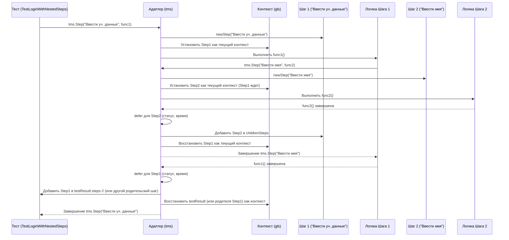

# Chapter 3: Шаги Теста


В [предыдущей главе](02_запуск_теста_и_метаданные_.md) мы научились запускать наши тесты и описывать их с помощью метаданных (`TestMetadata`), создавая что-то вроде "анкеты" для каждого теста. Адаптер теперь знает, *что* это за тест. Но что, если сам тест состоит из множества действий? Как сделать отчет о выполнении теста более подробным и понятным?

Представьте, что ваш автотест — это рецепт приготовления вкусного торта. Вы могли бы просто написать: "Приготовить торт". Если что-то пойдет не так, вы увидите только "Торт не получился". Но гораздо полезнее разбить рецепт на **шаги**:

1.  Смешать сухие ингредиенты.
2.  Взбить яйца с сахаром.
3.  Соединить все вместе.
4.  Выпекать 40 минут.
5.  Украсить кремом.

Теперь, если торт не удался, вы можете посмотреть, на *каком именно шаге* возникла проблема. Может быть, выпекание прошло нормально, но смешивание ингредиентов пошло не так?

Функция `tms.Step` в `adapters-go` позволяет сделать то же самое для ваших автотестов: разбить сложную логику на отдельные, именованные шаги. Адаптер запишет результат выполнения каждого шага (прошел он успешно или нет, сколько времени занял) и отправит эту подробную информацию в Test IT.

В этой главе мы разберем:

*   Зачем нужны шаги в тестах?
*   Как использовать `tms.Step` для выделения шагов?
*   Что такое вложенные шаги и как их создавать?
*   Как шаги отображаются в Test IT?

## Зачем разбивать тест на шаги?

Рассмотрим простой тест входа пользователя:

```go
package examples

import (
	"testing"
	"github.com/testit-tms/adapters-go"
)

func TestLoginSuccessful(t *testing.T) {
	// Метаданные теста (из главы 2)
	meta := tms.TestMetadata{
		DisplayName: "Успешный вход пользователя",
		WorkItemIds: []string{"PROJECT-T-10"},
	}

	tms.Test(t, meta, func() {
		// --- Начало логики теста ---
		t.Log("Открываем страницу входа...")
		// ... код открытия страницы ...
		pageOpened := true
		tms.True(t, pageOpened, "Страница входа должна открыться")

		t.Log("Вводим имя пользователя...")
		// ... код ввода имени ...
		usernameEntered := true
		tms.True(t, usernameEntered, "Имя пользователя должно быть введено")

		t.Log("Вводим пароль...")
		// ... код ввода пароля ...
		passwordEntered := true
		tms.True(t, passwordEntered, "Пароль должен быть введен")

		t.Log("Нажимаем кнопку 'Войти'...")
		// ... код нажатия кнопки ...
		buttonClicked := true
		tms.True(t, buttonClicked, "Кнопка 'Войти' должна быть нажата")

		t.Log("Проверяем, что пользователь вошел...")
		// ... код проверки результата ...
		loggedIn := true
		tms.True(t, loggedIn, "Пользователь должен успешно войти")
		// --- Конец логики теста ---
	})
}
```

Этот тест работает, но если он упадет, скажем, на этапе ввода пароля, в Test IT мы увидим только общее сообщение об ошибке для всего теста "Успешный вход пользователя". Будет не сразу очевидно, какая именно часть процесса входа сломалась.

Используя `tms.Step`, мы можем сделать отчет гораздо информативнее.

## Использование `tms.Step`

Функция `tms.Step` очень похожа на `tms.Test`. Она принимает метаданные шага и анонимную функцию, содержащую логику этого шага.

```go
package examples

import (
	"testing"
	"github.com/testit-tms/adapters-go"
)

func TestLoginSuccessfulWithSteps(t *testing.T) {
	meta := tms.TestMetadata{
		DisplayName: "Успешный вход пользователя (с шагами)",
		WorkItemIds: []string{"PROJECT-T-11"},
	}

	tms.Test(t, meta, func() {
		// --- Шаг 1: Открыть страницу входа ---
		tms.Step(tms.StepMetadata{Name: "Открыть страницу входа"}, func() {
			t.Log("Открываем страницу входа...")
			// ... код открытия страницы ...
			pageOpened := true
			tms.True(t, pageOpened) // Ассерт внутри шага
		})

		// --- Шаг 2: Ввести учетные данные ---
		tms.Step(tms.StepMetadata{Name: "Ввести учетные данные"}, func() {
			t.Log("Вводим имя пользователя...")
			// ... код ввода имени ...
			usernameEntered := true
			tms.True(t, usernameEntered)

			t.Log("Вводим пароль...")
			// ... код ввода пароля ...
			passwordEntered := true
			tms.True(t, passwordEntered)
		})

		// --- Шаг 3: Нажать кнопку 'Войти' ---
		tms.Step(tms.StepMetadata{Name: "Нажать кнопку 'Войти'"}, func() {
			t.Log("Нажимаем кнопку 'Войти'...")
			// ... код нажатия кнопки ...
			buttonClicked := true
			tms.True(t, buttonClicked)
		})

		// --- Шаг 4: Проверить результат ---
		tms.Step(tms.StepMetadata{Name: "Проверить успешный вход"}, func() {
			t.Log("Проверяем, что пользователь вошел...")
			// ... код проверки результата ...
			loggedIn := true
			tms.True(t, loggedIn) // Вложенный ассерт
		})
	})
}
```

Что изменилось?

1.  Мы импортировали `tms` так же, как и раньше.
2.  Внутри `tms.Test` мы обернули каждую логическую часть теста в вызов `tms.Step`.
3.  Каждый `tms.Step` получает структуру `tms.StepMetadata`, где мы указываем как минимум `Name` (Имя) шага.
4.  Логика и проверки ([Ассерты](05_проверки__ассерты_.md)), относящиеся к этому шагу, теперь находятся *внутри* анонимной функции этого `tms.Step`.

Теперь, когда этот тест выполнится, Test IT получит не только общий результат теста, но и результаты каждого из четырех шагов: "Открыть страницу входа", "Ввести учетные данные", "Нажать кнопку 'Войти'", "Проверить успешный вход". Если упадет, например, шаг "Ввести учетные данные", это будет явно видно в отчете.

### `StepMetadata`: Описание Шага

Структура `tms.StepMetadata` позволяет добавить больше деталей к вашему шагу:

```go
// Из файла step.go
type StepMetadata struct {
	Name        string                 // Имя шага (обязательно)
	Description string                 // Описание шага (пояснение, что он делает)
	Parameters  map[string]interface{} // Параметры шага (если шаг параметризован)
}
```

*   **`Name`**: Короткое, понятное имя шага. Оно будет отображаться в результатах теста в Test IT.
*   **`Description`**: Более подробное описание, которое может быть полезно для понимания цели шага.
*   **`Parameters`**: Словарь (map) для передачи параметров, специфичных для этого шага. Например, если шаг "Ввести данные" принимает имя пользователя и пароль, их можно указать здесь.

Пример с использованием `Description` и `Parameters`:

```go
// --- Шаг 2: Ввести учетные данные ---
creds := map[string]interface{}{"user": "testuser", "pass_type": "valid"}
tms.Step(tms.StepMetadata{
    Name:        "Ввести учетные данные",
    Description: "Ввод имени пользователя и пароля из тестовых данных.",
    Parameters:  creds, // Добавили параметры
}, func() {
    t.Log("Вводим имя пользователя:", creds["user"])
    // ... код ...
    tms.True(t, true)

    t.Log("Вводим пароль...")
    // ... код ...
    tms.True(t, true)
})
```

Эта дополнительная информация также будет отправлена в Test IT и поможет при анализе результатов.

## Вложенные Шаги: Детализация Рецепта

Иногда сам шаг может состоять из нескольких под-действий. Возвращаясь к аналогии с рецептом, шаг "Смешать сухие ингредиенты" можно разбить на:

1.1. Отмерить муку.
1.2. Добавить разрыхлитель.
1.3. Просеять вместе.

`tms.Step` позволяет делать то же самое — **вкладывать шаги друг в друга**. Просто вызовите `tms.Step` внутри анонимной функции другого `tms.Step`.

```go
package examples

import (
	"testing"
	"github.com/testit-tms/adapters-go"
)

func TestLoginWithNestedSteps(t *testing.T) {
	meta := tms.TestMetadata{
		DisplayName: "Вход с вложенными шагами",
		WorkItemIds: []string{"PROJECT-T-12"},
	}

	tms.Test(t, meta, func() {
		tms.Step(tms.StepMetadata{Name: "Открыть страницу входа"}, func() {
			t.Log("Открываем страницу...")
			tms.True(t, true)
		})

		// --- Родительский Шаг: Ввести учетные данные ---
		tms.Step(tms.StepMetadata{Name: "Ввести учетные данные"}, func() {

			// --- Вложенный Шаг 1: Ввести имя пользователя ---
			tms.Step(tms.StepMetadata{Name: "Ввести имя пользователя"}, func() {
				t.Log("Ищем поле имени...")
				tms.True(t, true)
				t.Log("Вводим 'testuser'...")
				tms.True(t, true)
			})

			// --- Вложенный Шаг 2: Ввести пароль ---
			tms.Step(tms.StepMetadata{Name: "Ввести пароль"}, func() {
				t.Log("Ищем поле пароля...")
				tms.True(t, true)
				t.Log("Вводим пароль...")
				passwordEntered := true // Допустим, здесь происходит сбой
				// tms.True(t, passwordEntered) // Закомментируем ассерт, чтобы шаг прошел
				// Представим, что сам код внутри шага вызвал ошибку
				if !passwordEntered {
					t.Error("Не удалось ввести пароль!") // Это приведет к падению родительского шага и теста
				}
			}) // <-- Конец вложенного шага 2

		}) // <-- Конец родительского шага

		tms.Step(tms.StepMetadata{Name: "Нажать кнопку 'Войти'"}, func() {
			t.Log("Нажимаем кнопку...")
			tms.True(t, true)
		})

		tms.Step(tms.StepMetadata{Name: "Проверить успешный вход"}, func() {
			t.Log("Проверяем результат...")
			tms.True(t, true)
		})
	})
}

```

В этом примере:
*   Шаг "Ввести учетные данные" теперь содержит два *вложенных* шага: "Ввести имя пользователя" и "Ввести пароль".
*   В Test IT результат будет выглядеть как иерархическая структура, где можно разворачивать родительские шаги, чтобы увидеть результаты вложенных.

**Важно:** Если какой-либо вложенный шаг завершается неудачно (например, из-за невыполненного ассерта `tms.False`, `t.Error` или паники), то он сам и все его родительские шаги также будут помечены как неудачные (`Failed`). Это логично: если мы не смогли "ввести пароль", то весь шаг "ввести учетные данные" тоже не был выполнен успешно.

## Как это работает "под капотом"?

Как адаптер понимает, какой шаг сейчас выполняется, особенно при наличии вложенности? Он использует механизм, похожий на "контекст выполнения".

1.  **Начало теста:** Когда вызывается `tms.Test`, создается основной объект `testResult`, который представляет весь тест. Этот объект становится текущим "контекстом".
2.  **Вызов `tms.Step`:**
    *   Создается новый объект `stepresult` (из `stepresult.go`) с информацией из `StepMetadata`. Записывается время начала шага (`startedOn`).
    *   **Важно:** Адаптер находит текущий "контекст" (это может быть или основной `testResult`, или `stepresult` родительского шага) с помощью специального хранилища, привязанного к текущей горутине (используется библиотека `gls` - Goroutine Local Storage).
    *   Новый `stepresult` устанавливается как *новый* текущий "контекст" для всего, что будет выполняться внутри его анонимной функции.
3.  **Выполнение анонимной функции `func()`:** Ваш код внутри шага выполняется в этом новом контексте. Если внутри вызывается еще один `tms.Step`, процесс повторяется для создания вложенного шага.
4.  **Завершение шага (`defer`):** С помощью `defer` гарантируется, что после завершения вашей функции (или если произошла паника) выполнится следующий код:
    *   Перехватывается возможная паника. Если она была, шаг помечается как `Failed`.
    *   Записывается время окончания шага (`completedOn`) и вычисляется длительность (`duration`).
    *   Определяется статус шага (`status`): если внутри шага были ошибки (`t.Error`, `t.Fail`, паника, или ассерты адаптера вроде `tms.False`), статус будет `Failed`, иначе `Passed`.
    *   **Важно:** Завершенный `stepresult` добавляется в список дочерних шагов (`childrenSteps`) того объекта, который был "контекстом" *до* начала этого шага (благодаря `gls`).
    *   Контекст "возвращается" на уровень выше.

Представим это в виде диаграммы для примера с вложенными шагами:



Ключевая магия здесь — это использование контекста (`gls`), который позволяет адаптеру всегда знать, к какому родительскому элементу (тесту или другому шагу) относится текущий шаг, и куда добавлять его результат после выполнения.

**Взгляд на код:**

Основная логика находится в `step.go`:

```go
// Файл: step.go (упрощено)
package tms

import (
	"time"
	"github.com/jtolds/gls" // Библиотека для контекста горутин
	"github.com/pkg/errors"  // Для обработки паники
)

// ... StepMetadata ...

// Основная функция для создания шага
func Step(m StepMetadata, f func()) {
	step := newStep(m) // Создаем объект stepresult

	// defer гарантирует выполнение этого блока после f()
	defer func() {
		panicObject := recover() // Ловим панику, если она была
		step.completedOn = time.Now() // Записываем время окончания
		step.duration = step.completedOn.UnixMilli() - step.startedOn.UnixMilli() // Считаем длительность

		// Если была паника, помечаем шаг как Failed
		if panicObject != nil {
			// ... (логика обработки паники и установки статуса Failed) ...
			fail(errors.Errorf("%+v", panicObject)) // Устанавливает статус ошибки в текущем контексте
		}

		// Если статус еще не Failed (например, из-за ассерта), считаем его Passed
		if step.status == "" {
			step.status = passed // 'passed' - константа "Passed"
		}

		// Находим родительский элемент (тест или другой шаг) в контексте
		manipulateOnObjectFromCtx(nodeKey, func(parentNode interface{}) {
			// Добавляем наш завершенный шаг к родителю
			hasStep := parentNode.(hasSteps) // hasSteps - интерфейс с методом addStep
			hasStep.addStep(*step)

			// Обновляем статус родителя, если наш шаг упал
			hasStatus := parentNode.(hasStatus) // hasStatus - интерфейс с методом addStatus
			hasStatus.addStatus(step.status)
		})
	}() // Конец defer

	// Устанавливаем 'step' как текущий контекст 'nodeKey'
	// и выполняем пользовательскую функцию f() в этом контексте
	ctxMgr.SetValues(gls.Values{nodeKey: step}, f)
}

// Создает начальный объект шага
func newStep(m StepMetadata) *stepresult {
	step := &stepresult{
		description: m.Description,
		startedOn:   time.Now(),
		parameters:  m.Parameters,
		name:        m.Name,
	}
	// ... (установка имени по умолчанию) ...
	return step
}

// Структура для хранения данных шага
// Файл: stepresult.go
type stepresult struct {
	name          string
	description   string
	childrenSteps []stepresult // Вложенные шаги!
	status        string       // Passed, Failed
	startedOn     time.Time
	completedOn   time.Time
	duration      int64
	attachments   []string             // Аттачи шага (см. Главу 6)
	parameters    map[string]interface{}
}

// Метод для добавления вложенного шага
func (s *stepresult) addStep(step stepresult) {
	s.childrenSteps = append(s.childrenSteps, step)
}

// Метод для обновления статуса (если дочерний шаг упал)
func (s *stepresult) addStatus(status string) {
	// Если дочерний шаг упал (Failed), то и родительский должен быть Failed
	if status == failed {
		s.status = failed
	}
}

// ... другие методы интерфейсов hasSteps, hasStatus ...
```

Функция `manipulateOnObjectFromCtx` (вспомогательная функция адаптера) использует `gls` для получения текущего объекта из контекста (`nodeKey` - это ключ, по которому хранится текущий шаг или тест), а `ctxMgr.SetValues` устанавливает новый контекст перед выполнением пользовательской функции.

Когда данные отправляются в Test IT, функция `stepToAttachmentPutModelAutoTestStepResultsModel` в `converter.go` рекурсивно обходит структуру шагов и вложенных шагов, преобразуя их в формат, понятный API Test IT.

## Заключение

Мы научились использовать `tms.Step`, чтобы разбивать наши тесты на логические части — шаги. Это делает тесты более читаемыми, а отчеты в Test IT — гораздо более информативными, позволяя быстро pinpoint (точно определить) место сбоя. Мы также увидели, как можно создавать вложенные шаги для еще большей детализации сложных операций. За кулисами адаптер использует контекст горутин (`gls`), чтобы корректно отслеживать иерархию шагов и их результаты.

Теперь, когда наши тесты имеют структуру (тест -> шаги -> вложенные шаги), нам часто нужно выполнять какие-то подготовительные действия *перед* тестом (например, создать тестовые данные) и завершающие действия *после* теста (например, очистить данные). Как это сделать правильно?

Об этом мы поговорим в следующей главе: [Подготовка и Завершение (Фикстуры)](04_подготовка_и_завершение__фикстуры__.md).

---

Generated by [AI Codebase Knowledge Builder](https://github.com/The-Pocket/Tutorial-Codebase-Knowledge)