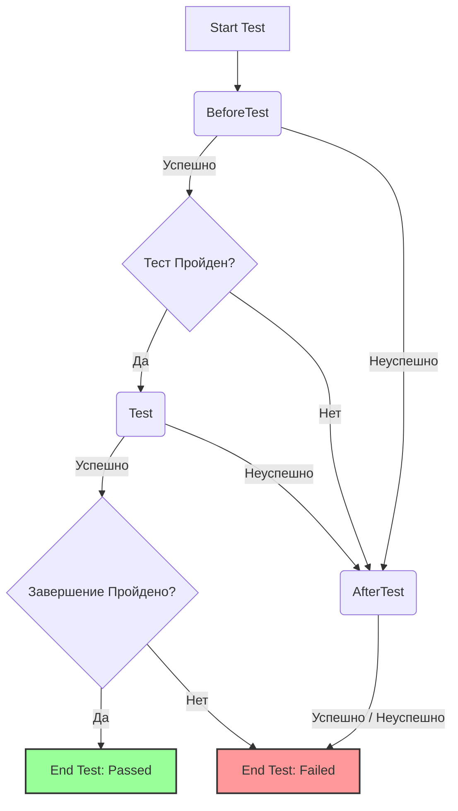
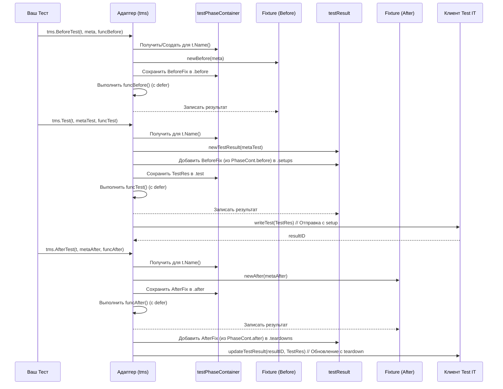

# Chapter 4: Подготовка и Завершение (Фикстуры)


В [предыдущей главе](03_шаги_теста_.md) мы научились разбивать наши тесты на подробные шаги с помощью `tms.Step`. Теперь наши отчеты в Test IT похожи на детальный рецепт. Но что, если для нашего "рецепта" (теста) нужна предварительная подготовка (например, разогреть духовку) и последующая уборка (помыть посуду)?

Представьте себе театральную постановку. Прежде чем начнется основной спектакль (ваш тест), нужно **подготовить сцену**: расставить декорации, настроить свет. Это важная часть, и если декорация упадет во время подготовки, это повлияет на весь спектакль. После окончания спектакля сцену нужно **убрать**: демонтировать декорации, выключить свет. Это тоже важный этап.

В мире `adapters-go` функции `tms.BeforeTest` и `tms.AfterTest` играют роль такой подготовки и уборки сцены. Они позволяют определить действия, которые должны выполняться **до** и **после** основной логики вашего теста. Адаптер не просто выполняет эти действия, он **записывает их как специальные шаги** (setup и teardown) и отслеживает, успешно ли они прошли. Это помогает понять, не возникла ли проблема еще на этапе подготовки или уже после завершения основной проверки.

В этой главе мы узнаем:
*   Зачем нужны подготовка и завершение в тестах?
*   Как использовать `tms.BeforeTest` для настройки окружения?
*   Как использовать `tms.AfterTest` для очистки после теста?
*   Как результаты подготовки и завершения влияют на общий статус теста?

## Зачем нужны подготовка (Setup) и завершение (Teardown)?

Многие тесты требуют определенного состояния системы перед запуском основной проверки и возвращения системы в исходное состояние после.

**Примеры подготовительных действий (`BeforeTest`/Setup):**
*   Создание временного файла или директории.
*   Запись тестовых данных в базу данных.
*   Запуск эмулятора или другого сервиса.
*   Получение токена авторизации.

**Примеры завершающих действий (`AfterTest`/Teardown):**
*   Удаление временных файлов или директорий.
*   Удаление тестовых данных из базы данных.
*   Остановка эмулятора или сервиса.
*   Выход из системы (logout).

Выполнять эти действия внутри основной логики теста (`tms.Test` или `tms.Step`) неудобно:
1.  **Загромождает тест:** Основная логика теста становится менее читаемой из-за кода подготовки/очистки.
2.  **Не всегда выполняется:** Если тест упадет в середине, код очистки в конце теста может не выполниться.
3.  **Неинформативно:** Не видно, на каком этапе (подготовка, основной тест, очистка) произошла проблема.

Функции `tms.BeforeTest` и `tms.AfterTest` решают эти проблемы, позволяя явно выделить и отследить эти этапы.

## `tms.BeforeTest`: Подготовка сцены

Эта функция выполняется **до** вызова `tms.Test`. Она идеально подходит для настройки всего необходимого перед основной проверкой.

```go
package examples

import (
	"fmt"
	"os"
	"testing"
	"github.com/testit-tms/adapters-go"
)

func TestWithSetup(t *testing.T) {
	var tempFileName string // Переменная для имени файла

	// --- Блок подготовки ---
	tms.BeforeTest(t, tms.StepMetadata{Name: "Создание временного файла"}, func() {
		t.Log("Подготовка: Создаем файл...")
		file, err := os.CreateTemp("", "my-test-*.txt")
		if err != nil {
			t.Fatalf("Не удалось создать временный файл: %v", err) // Прерываем тест, если подготовка не удалась
		}
		tempFileName = file.Name() // Сохраняем имя файла
		file.Close()
		t.Logf("Временный файл создан: %s", tempFileName)
		// tms.True(t, true) // Можно использовать ассерты и здесь
	})

	// --- Основной тест ---
	meta := tms.TestMetadata{DisplayName: "Тест с использованием файла"}
	tms.Test(t, meta, func() {
		t.Logf("Тест: Проверяем наличие файла %s", tempFileName)
		_, err := os.Stat(tempFileName)
		tms.Nil(t, err, "Файл должен существовать") // Проверяем, что файл есть
	})

	// --- Блок завершения (пока без tms.AfterTest) ---
	// После теста нам нужно будет удалить этот файл
	// См. следующий раздел про tms.AfterTest
	defer os.Remove(tempFileName) // Используем defer для простоты, но лучше tms.AfterTest
}
```

**Разбор кода:**

1.  `tms.BeforeTest(t, tms.StepMetadata{...}, func() { ... })`:
    *   Первый аргумент `t` — стандартный `*testing.T`.
    *   Второй аргумент — `tms.StepMetadata`, где мы задаем имя этому подготовительному шагу (например, "Создание временного файла"). Вы можете добавить `Description` и `Parameters`, как и для обычных шагов.
    *   Третий аргумент — анонимная функция, содержащая код подготовки.
2.  Внутри функции мы создаем временный файл и сохраняем его имя в переменной `tempFileName`, которая доступна и в `tms.Test`.
3.  **Важно:** Если внутри `tms.BeforeTest` произойдет ошибка (`t.Fatalf` или паника), выполнение теста *прервется*, и `tms.Test` **не будет вызван**. Адаптер запишет результат `BeforeTest` как `Failed`.

В Test IT этот блок будет отображен как специальный шаг "setup" с именем "Создание временного файла".

## `tms.AfterTest`: Уборка сцены

Эта функция выполняется **после** завершения `tms.Test`, *независимо от того, прошел тест успешно или упал*. Она идеально подходит для очистки ресурсов.

Дополним предыдущий пример, используя `tms.AfterTest` для удаления файла:

```go
package examples

import (
	"fmt"
	"os"
	"testing"
	"github.com/testit-tms/adapters-go"
)

func TestWithSetupAndTeardown(t *testing.T) {
	var tempFileName string // Доступна во всех блоках

	// --- Подготовка ---
	tms.BeforeTest(t, tms.StepMetadata{Name: "Создание временного файла"}, func() {
		t.Log("Подготовка: Создаем файл...")
		file, err := os.CreateTemp("", "my-test-*.txt")
		if err != nil {
			t.Fatalf("Не удалось создать временный файл: %v", err)
		}
		tempFileName = file.Name()
		file.Close()
		t.Logf("Временный файл создан: %s", tempFileName)
	})

	// --- Основной тест ---
	meta := tms.TestMetadata{DisplayName: "Тест с подготовкой и завершением"}
	tms.Test(t, meta, func() {
		tms.Step(tms.StepMetadata{Name: "Проверка файла"}, func() {
			t.Logf("Тест: Проверяем наличие файла %s", tempFileName)
			_, err := os.Stat(tempFileName)
			tms.Nil(t, err, "Файл должен существовать")
		})
		// Представим, что здесь тест падает
		// tms.Fail(t, "Имитация падения основного теста")
	})

	// --- Завершение ---
	tms.AfterTest(t, tms.StepMetadata{Name: "Удаление временного файла"}, func() {
		t.Logf("Завершение: Удаляем файл %s...", tempFileName)
		err := os.Remove(tempFileName)
		// Используем t.Error, а не t.Fatal, т.к. основной тест уже прошел
		if err != nil {
			t.Errorf("Не удалось удалить временный файл: %v", err)
		} else {
			t.Log("Временный файл успешно удален.")
		}
		// tms.True(t, err == nil) // Можно использовать ассерты
	})
}

```

**Разбор кода:**

1.  `tms.AfterTest(t, tms.StepMetadata{...}, func() { ... })`: Структура вызова аналогична `tms.BeforeTest`. Мы передаем `t`, метаданные шага завершения и функцию с кодом очистки.
2.  Код внутри `tms.AfterTest` пытается удалить файл, созданный в `tms.BeforeTest`.
3.  **Важно:** `tms.AfterTest` выполнится *даже если* `tms.Test` упал. Это гарантирует попытку очистки ресурсов.
4.  Если `tms.AfterTest` завершается с ошибкой (`t.Errorf`, паника, неудачный ассерт), это будет зафиксировано, и общий статус теста также может стать `Failed` (даже если `tms.Test` прошел успешно).

В Test IT этот блок будет отображен как специальный шаг "teardown" с именем "Удаление временного файла".

## Как результаты фикстур влияют на тест?

*   **Если `tms.BeforeTest` падает (Failed):**
    *   Основной тест (`tms.Test`) **не выполняется**.
    *   Завершение (`tms.AfterTest`), если оно определено, **все равно выполняется** (чтобы попытаться очистить то, что могло быть создано до сбоя).
    *   Общий статус теста в Test IT будет `Failed`.
*   **Если `tms.Test` падает (Failed):**
    *   `tms.AfterTest`, если он определен, **выполняется**.
    *   Общий статус теста будет `Failed`.
*   **Если `tms.Test` проходит успешно (Passed), но `tms.AfterTest` падает (Failed):**
    *   Общий статус теста будет `Failed`.

Адаптер отслеживает статус каждого из трех этапов (Before, Test, After) и использует их для определения финального статуса всего теста. В Test IT вы увидите отдельные записи для шагов setup (из `BeforeTest`) и teardown (из `AfterTest`) вместе с обычными шагами из `tms.Test`.



## Как это работает "под капотом"?

Адаптер использует небольшой внутренний "контейнер" для каждого теста (`testPhaseContainer`), чтобы отслеживать выполнение фаз Before, Test и After.

1.  **Вызов `tms.BeforeTest`:**
    *   Находится или создается `testPhaseContainer` для текущего теста (идентифицируемого по `t.Name()`).
    *   Создается объект `fixture` (из `fixture.go`) для хранения информации о блоке Before (имя, статус, время и т.д.).
    *   Этот объект `fixture` сохраняется в поле `before` контейнера `testPhaseContainer`.
    *   Выполняется пользовательская функция подготовки. Используется `defer` для перехвата паники и фиксации результата (статус, время).
    *   **Важно:** `tms.Test` еще не вызывался, и основной `testResult` еще не создан.
2.  **Вызов `tms.Test`:**
    *   Находится тот же `testPhaseContainer`.
    *   Создается основной объект `testResult` (из `testresult.go`).
    *   Результат выполнения блока `BeforeTest` (если он был) из `testPhaseContainer.before` копируется в поле `setups` объекта `testResult` (после преобразования в `stepresult`).
    *   `testResult` сохраняется в поле `test` контейнера `testPhaseContainer`.
    *   Выполняется основная логика теста (с шагами `tms.Step`). `defer` внутри `tms.Test` фиксирует результат.
    *   Результат (`testResult`) отправляется в Test IT (в `client.writeTest`). При этом отправляются и данные из `setups`. **Записывается ID результата теста.**
3.  **Вызов `tms.AfterTest`:**
    *   Находится тот же `testPhaseContainer`.
    *   Создается объект `fixture` для хранения информации о блоке After.
    *   Этот объект `fixture` сохраняется в поле `after` контейнера `testPhaseContainer`.
    *   Выполняется пользовательская функция завершения. Используется `defer` для перехвата паники и фиксации результата.
    *   **Важно:** Результат блока After копируется в поле `teardowns` объекта `testResult`, который уже существует в контейнере (`testPhaseContainer.test`).
    *   **Обновление результата:** Вызывается `client.updateTestResult`, чтобы **обновить** уже существующий результат теста в Test IT, добавив к нему информацию о выполнении блока teardown и, возможно, изменив общий статус теста, если teardown упал. Используется ID результата, сохраненный на шаге 2.



**Взгляд на код:**

Контейнер `testPhaseContainer` (из `container.go`) просто хранит указатели на объекты фикстур и основного теста:

```go
// Файл: container.go (упрощено)
package tms

import "testing"

// Структура для хранения состояния теста (Before, Test, After)
type testPhaseContainer struct {
	before   *fixture    // Результат tms.BeforeTest
	test     *testResult // Результат tms.Test
	resultID string      // ID результата, полученный после tms.Test
	after    *fixture    // Результат tms.AfterTest
}

// Глобальная карта для хранения контейнеров для каждого теста
var testPhaseObjects = make(map[string]*testPhaseContainer)

// Получает (или создает) контейнер для теста по его имени
func getCurrentTestPhaseObject(t *testing.T) *testPhaseContainer {
	// ... (логика получения или создания контейнера) ...
}
```

Сами `BeforeTest` и `AfterTest` создают объект `fixture` и выполняют пользовательский код, используя `defer` для надежной фиксации результата. Обратите внимание, что `AfterTest` вызывает `tr.update(testPhaseObject.resultID)` для обновления уже созданного результата теста.

```go
// Файл: before.go (фрагмент)
package tms

func BeforeTest(t *testing.T, m StepMetadata, f func()) {
	testPhaseObject := getCurrentTestPhaseObject(t)
	// ... (проверка, что тест еще не начался) ...
	before := newBefore(m) // Создаем fixture
	testPhaseObject.before = before // Сохраняем в контейнер

	defer func() {
		// ... (перехват паники, фиксация времени и статуса в 'before') ...
	}()
	// ... (выполнение f() с установкой контекста) ...
}

// ---

// Файл: after.go (фрагмент)
package tms

func AfterTest(t *testing.T, m StepMetadata, f func()) {
	after := newAfter(m) // Создаем fixture (не сохраняем сразу в контейнер)

	defer func() {
		// ... (фиксация времени и статуса в 'after') ...

		testPhaseObject := getCurrentTestPhaseObject(t)
		// ... (проверка, что тест уже был запущен) ...
		tr := testPhaseObject.test // Получаем testResult из контейнера

		// ... (обработка паники, обновление статуса 'after' и 'tr') ...

		// Добавляем результат After (преобразованный в stepresult) в teardowns
		tr.addAfter(after.convertToStepResult())
		// Обновляем результат теста в Test IT, используя ID, сохраненный после tms.Test
		tr.update(testPhaseObject.resultID)
	}()
	// ... (выполнение f() с установкой контекста) ...
}

```

Структура `fixture` (из `fixture.go`) очень похожа на `stepresult`, она хранит имя, описание, статус, время, дочерние шаги (да, внутри Before/After можно использовать `tms.Step`!), вложения и т.д. Метод `convertToStepResult` преобразует `fixture` в `stepresult` для добавления в поля `setups` или `teardowns` основного `testResult`.

```go
// Файл: fixture.go (упрощено)
package tms

import "time"

// Структура для хранения данных Before/After
type fixture struct {
	name          string
	description   string
	childrenSteps []stepresult // Вложенные шаги внутри фикстуры
	status        string       // Passed/Failed
	startedOn     time.Time
	completedOn   time.Time
	duration      int64
	// ... (поля для attachments, parameters, message, trace) ...
}

// Преобразует fixture в stepresult для добавления в testResult
func (f *fixture) convertToStepResult() stepresult {
	return stepresult{
		name:          f.name,
		description:   f.description,
		childrenSteps: f.childrenSteps,
		status:        f.status,
		startedOn:     f.startedOn,
		// ... (копирование остальных полей) ...
	}
}
// ... (методы addStep, addStatus и т.д., похожие на stepresult) ...
```

## Заключение

В этой главе мы изучили, как использовать `tms.BeforeTest` и `tms.AfterTest` для организации подготовительных и завершающих действий в наших тестах. Мы увидели, что эти блоки выполняются до и после основной логики теста (`tms.Test`), их результаты (успех или неудача) записываются адаптером как специальные setup/teardown шаги и влияют на общий статус теста. Использование фикстур делает тесты чище, надежнее и информативнее, позволяя точно определить, на каком этапе возникла проблема: при подготовке, во время основной проверки или при очистке.

Теперь, когда мы умеем структурировать тесты с помощью шагов и фикстур, самое время поговорить о том, как мы на самом деле проверяем условия в наших тестах — об ассертах.

Об этом мы поговорим в следующей главе: [Проверки (Ассерты)](05_проверки__ассерты__.md).

---

Generated by [AI Codebase Knowledge Builder](https://github.com/The-Pocket/Tutorial-Codebase-Knowledge)