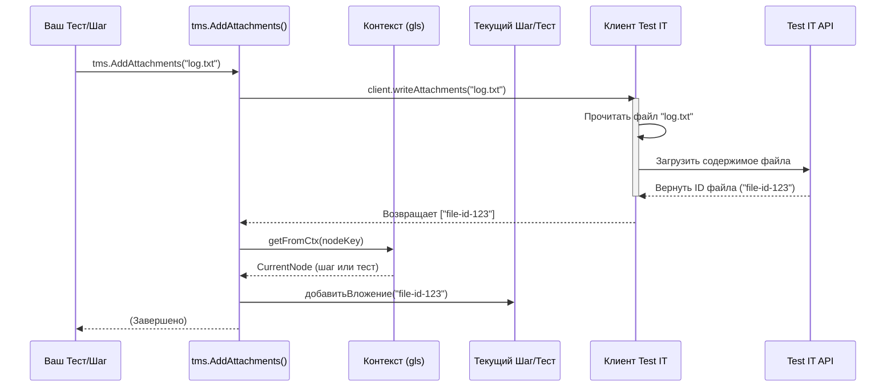

# Chapter 6: Методы Добавления Информации


В [предыдущей главе](05_проверки__ассерты__.md) мы разобрались, как использовать ассерты (`tms.Equal`, `tms.True` и другие), чтобы проверять условия в наших тестах и автоматически записывать детальные сообщения об ошибках. Теперь наши тесты могут сказать "Да, это верно" или "Нет, вот здесь ошибка". Но иногда нам нужно добавить к отчету больше контекста, чем просто результат "прошел/упал".

Представьте, что вы выполняете сложную миссию (ваш автотест). Во время миссии вы можете захотеть:
*   **Сделать быструю заметку:** "Достиг точки Альфа, все спокойно." (`AddMessage`)
*   **Прикрепить карту местности:** Показать маршрут или проблемный участок. (`AddAttachments`)
*   **Оставить ссылку на досье цели:** Ссылка на детальное описание в базе данных. (`AddLinks`)

Просто сказать "Миссия выполнена" или "Миссия провалена" - недостаточно. Эти дополнительные материалы помогут понять, *как именно* проходила миссия, какие были особенности или где искать дополнительную информацию.

Библиотека `adapters-go` предоставляет специальные функции (`tms.AddMessage`, `tms.AddLinks`, `tms.AddAttachments`), которые позволяют вам делать такие "заметки" и "вложения" прямо во время выполнения теста или его шага. Эта информация будет добавлена к результату текущего теста или шага в Test IT.

В этой главе мы изучим:
*   Зачем добавлять дополнительную информацию к результатам теста?
*   Как использовать `tms.AddMessage` для добавления текстовых сообщений?
*   Как использовать `tms.AddLinks` для прикрепления ссылок?
*   Как использовать `tms.AddAttachments` для добавления файлов?

## Зачем добавлять информацию?

Результаты тестов в Test IT — это не просто список "прошел/упал". Это детализированные отчеты, которые помогают анализировать состояние вашего продукта. Дополнительная информация может быть критически важной:

*   **Логи:** Если тест упал, прикрепленные логи могут помочь разработчику быстро найти причину.
*   **Скриншоты:** Для UI-тестов скриншот в момент ошибки бесценен.
*   **Ссылки:** Ссылки на связанные задачи в баг-трекере, требования или полезные ресурсы экономят время на поиск.
*   **Контекстные сообщения:** Промежуточные сообщения о статусе могут помочь понять, до какой точки дошел тест перед падением.

Эти методы позволяют обогатить ваши отчеты, сделав их намного полезнее для всей команды.

## `tms.AddMessage`: Делаем заметки

Самый простой способ добавить информацию — это простое текстовое сообщение. Функция `tms.AddMessage` позволяет записать строку в лог текущего теста или шага в Test IT.

```go
package examples

import (
	"fmt"
	"testing"
	"time"

	"github.com/testit-tms/adapters-go"
)

func TestWithMessage(t *testing.T) {
	meta := tms.TestMetadata{DisplayName: "Тест с добавлением сообщения"}
	tms.Test(t, meta, func() {
		// Начало важной операции
		operationStartTime := time.Now()
		tms.AddMessage(fmt.Sprintf("Начинаем операцию в %s", operationStartTime.Format(time.RFC3339)))

		// ... здесь выполняется какая-то долгая операция ...
		time.Sleep(100 * time.Millisecond) // Имитация работы
		result := "Успех"

		// Добавляем сообщение о результате
		tms.AddMessage(fmt.Sprintf("Операция завершена с результатом: %s", result))

		// Проверка результата
		tms.Step(tms.StepMetadata{Name: "Проверка результата"}, func() {
			tms.Equal(t, "Успех", result)
		})
	})
}

```

**Объяснение:**

1.  Мы вызываем `tms.AddMessage("...")` внутри `tms.Test`.
2.  Переданная строка ("Начинаем операцию...") будет добавлена к результатам этого теста в Test IT.
3.  Вы можете вызывать `tms.AddMessage` несколько раз, и все сообщения будут добавлены.
4.  Эти сообщения можно добавлять и внутри [Шагов Теста](03_шаги_теста_.md) (`tms.Step`). Сообщение будет привязано к тому шагу, внутри которого оно было вызвано.

В Test IT эти сообщения будут видны в деталях результата выполнения теста или шага. Это полезно для отслеживания хода выполнения или записи важных промежуточных значений.

## `tms.AddLinks`: Добавляем ссылки

Часто бывает нужно сослаться на внешний ресурс: задачу в Jira, страницу в Confluence, репозиторий с кодом и т.д. Функция `tms.AddLinks` позволяет добавить одну или несколько структурированных ссылок к результату теста.

Для добавления ссылки используется структура `tms.Link`:

```go
// Из файла link.go
type Link struct {
	Url         string   // URL ссылки (обязательно)
	Title       string   // Заголовок ссылки (отображается в Test IT)
	Description string   // Описание ссылки (опционально)
	LinkType    LinkType // Тип ссылки (Requirement, Bug, Issue и т.д.)
}

// Типы ссылок (константы)
// LINKTYPE_RELATED, LINKTYPE_BLOCKED_BY, LINKTYPE_DEFECT,
// LINKTYPE_ISSUE, LINKTYPE_REQUIREMENT, LINKTYPE_REPOSITORY
```

Пример использования `tms.AddLinks`:

```go
package examples

import (
	"testing"
	"github.com/testit-tms/adapters-go"
)

func TestWithLinks(t *testing.T) {
	meta := tms.TestMetadata{DisplayName: "Тест с добавлением ссылок"}
	tms.Test(t, meta, func() {
		tms.Step(tms.StepMetadata{Name: "Шаг 1: Проверка данных"}, func() {
			// ... какая-то логика ...
			dataIsValid := true
			tms.True(t, dataIsValid)
		})

		tms.Step(tms.StepMetadata{Name: "Шаг 2: Обработка и добавление ссылок"}, func() {
			// ... логика обработки ...
			processingOk := true
			if !processingOk {
				// Если обработка неудачна, добавляем ссылку на баг
				tms.AddLinks(tms.Link{
					Url:      "https://jira.example.com/browse/PROJ-123",
					Title:    "Баг PROJ-123: Ошибка обработки данных",
					LinkType: tms.LINKTYPE_DEFECT, // Указываем тип
				})
				tms.Fail(t, "Обработка данных не удалась")
			}

			// Добавляем ссылку на документацию в любом случае
			tms.AddLinks(tms.Link{
				Url:         "https://docs.example.com/processing",
				Title:       "Документация по обработке",
				Description: "Страница описывает алгоритм",
				LinkType:    tms.LINKTYPE_RELATED,
			})

			tms.True(t, processingOk)
		})
	})
}
```

**Объяснение:**

1.  Мы создаем объект `tms.Link`, заполняя его поля (`Url`, `Title`, `LinkType`). Поле `Url` должно быть корректным URL.
2.  Мы передаем этот объект в `tms.AddLinks`.
3.  Эта ссылка будет добавлена к результату того шага (`Шаг 2`), внутри которого была вызвана функция. Если бы мы вызвали `tms.AddLinks` вне шагов (но внутри `tms.Test`), ссылка была бы добавлена к общему результату теста.
4.  **Важно:** Не путайте `tms.AddLinks` с полем `Links` в `tms.TestMetadata` ([Глава 2](02_запуск_теста_и_метаданные_.md)). Метаданные `Links` добавляют ссылки в *карточку самого автотеста* (описание), а `tms.AddLinks` добавляет ссылки в *конкретный результат запуска* этого теста.

В Test IT эти ссылки появятся в секции "Ссылки" у соответствующего шага или теста.

## `tms.AddAttachments`: Прикрепляем файлы

Возможно, самая мощная функция — `tms.AddAttachments`. Она позволяет вам прикрепить один или несколько файлов к результату теста или шага. Это могут быть логи, скриншоты, файлы с данными и т.д.

```go
package examples

import (
	"os"
	"testing"
	"github.com/testit-tms/adapters-go"
)

func TestWithAttachment(t *testing.T) {
	// --- Сначала создадим временный файл лога для примера ---
	logFileName := "test_run.log"
	logContent := []byte("INFO: Test started\nERROR: Something failed\nINFO: Test finished\n")
	err := os.WriteFile(logFileName, logContent, 0644) // Права на чтение/запись
	if err != nil {
		t.Fatalf("Не удалось создать файл лога: %v", err)
	}
	// Убедимся, что файл удалится после теста
	defer os.Remove(logFileName)

	// --- Сам тест ---
	meta := tms.TestMetadata{DisplayName: "Тест с прикреплением файла"}
	tms.Test(t, meta, func() {
		t.Log("Выполняем тест...")
		testFailed := true // Имитируем падение

		if testFailed {
			tms.AddMessage("Тест упал, прикрепляем лог.")
			// Прикрепляем файл лога
			tms.AddAtachments(logFileName) // Передаем путь к файлу

			// Используем tms.Fail, чтобы тест был помечен как упавший
			tms.Fail(t, "Тест симулированно упал.")
		} else {
			tms.Pass(t, "Тест прошел успешно.")
		}
	})
}

```

**Объяснение:**

1.  Мы создаем файл `test_run.log` (в реальном тесте он может генерироваться самим тестом).
2.  Внутри `tms.Test` (или `tms.Step`), если тест падает, мы вызываем `tms.AddAtachments(logFileName)`. В функцию передается путь к файлу, который нужно прикрепить.
3.  Можно передать несколько путей, чтобы прикрепить несколько файлов за раз: `tms.AddAtachments("log.txt", "screenshot.png")`.
4.  Адаптер прочитает этот файл, отправит его содержимое в Test IT и прикрепит к результату текущего теста (или шага).

В Test IT эти файлы будут доступны для скачивания в секции "Вложения" результата теста/шага.

**Альтернатива:** `tms.AddAttachmentsFromString(name, content string)`
Если у вас содержимое файла находится прямо в строковой переменной (например, лог), вы можете использовать эту функцию. Она создаст временный файл с указанным именем (`name`) и содержимым (`content`), прикрепит его, а затем удалит временный файл.

```go
logContentString := "DEBUG: Step 1 OK\nWARN: Low memory"
tms.AddAtachmentsFromString("runtime.log", logContentString)
```

## Как это работает "под капотом"?

Все эти функции (`AddMessage`, `AddLinks`, `AddAttachments`) работают схожим образом, используя контекст горутин (`gls`), о котором мы говорили в главах про [Шаги Теста](03_шаги_теста_.md) и [Проверки (Ассерты)](05_проверки__ассерты__.md).

1.  **Поиск контекста:** Когда вы вызываете, например, `tms.AddMessage("...")`:
    *   Функция использует `gls` (через `ctxMgr.GetValue(nodeKey)` или `ctxMgr.GetValue(testResultKey)`), чтобы найти текущий "активный" объект. Это может быть либо объект `stepresult` текущего шага, либо `testResult` для всего теста (если вызов происходит вне шагов).
2.  **Добавление данных:**
    *   **`AddMessage`:** Полученная строка просто добавляется к полю `message` объекта `testResult` (сообщение добавляется к общему результату теста, а не к шагам, судя по коду `methods.go`).
    *   **`AddLinks`:** Объект `tms.Link` добавляется в срез `resultLinks` объекта `testResult` (ссылки тоже добавляются к общему результату теста).
    *   **`AddAttachments`:**
        *   Сначала вызывается `client.writeAttachments(paths...)`. Эта функция [Клиента Test IT](08_клиент_test_it_.md) читает файлы по указанным путям.
        *   Клиент отправляет содержимое файлов через API Test IT на сервер.
        *   API возвращает уникальные идентификаторы (ID) для каждого загруженного файла.
        *   Функция `client.writeAttachments` возвращает эти ID в виде среза строк.
        *   Затем адаптер находит текущий объект (`stepresult` или `testResult`) через `gls` (`ctxMgr.GetValue(nodeKey)`).
        *   Полученные ID вложений добавляются в поле `attachments` этого объекта (шага или теста).

3.  **Отправка в Test IT:** Когда тест или шаг завершается, весь объект (`testResult` или `stepresult`), включая добавленные сообщения, ссылки и *ID* вложений, отправляется в Test IT как часть [Результата Теста](07_результат_теста_.md). Test IT затем использует ID вложений, чтобы отобразить сами файлы.

Вот как выглядит упрощенная диаграмма для `AddAttachments`:



**Взгляд на код (`methods.go`):**

```go
// Файл: methods.go (упрощено)
package tms

import (
	"os"
	"path/filepath"
	"golang.org/x/exp/slog"
)

// Добавляет сообщение к ОБЩЕМУ результату теста
func AddMessage(m string) {
	// Ищем объект testResult всего теста в контексте
	if node, ok := ctxMgr.GetValue(testResultKey); ok { // testResultKey - ключ для testResult
		tr := node.(*testResult)
		tr.message = m // Добавляем сообщение
	}
}

// Добавляет ссылку к ОБЩЕМУ результату теста
func AddLinks(l Link) {
	// Ищем объект testResult всего теста в контексте
	if node, ok := ctxMgr.GetValue(testResultKey); ok { // testResultKey - ключ для testResult
		tr := node.(*testResult)
		tr.resultLinks = append(tr.resultLinks, l) // Добавляем ссылку в срез
	}
}

// Добавляет вложения к ТЕКУЩЕМУ узлу (шаг или тест)
func AddAtachments(paths ...string) {
	// 1. Загружаем файлы через клиент и получаем их ID
	atachs := client.writeAttachments(paths...) // Возвращает []string с ID

	// 2. Находим текущий узел (шаг или тест) в контексте
	if node, ok := ctxMgr.GetValue(nodeKey); ok { // nodeKey - ключ для текущего узла
		// Преобразуем узел к интерфейсу, у которого есть метод addAttachments
		n := node.(hasAttachments)
		// 3. Добавляем каждый ID вложения к этому узлу
		for _, a := range atachs {
			n.addAttachments(a)
		}
	}
}

// Добавляет вложение из строки к ТЕКУЩЕМУ узлу
func AddAtachmentsFromString(name, content string) {
	// ... (код для создания временного файла) ...
	fp := filepath.Join(path, name) // Путь к временному файлу
	err = os.WriteFile(fp, []byte(content), 0644)
	// ... (обработка ошибок) ...

	// Прикрепляем созданный временный файл (также получаем ID)
	attachs := client.writeAttachments(fp)

	// Добавляем ID к текущему узлу (так же, как в AddAttachments)
	if node, ok := ctxMgr.GetValue(nodeKey); ok {
		n := node.(hasAttachments)
		for _, a := range attachs {
			n.addAttachments(a)
		}
	}

	// Удаляем временный файл
	err = os.Remove(fp)
	// ... (обработка ошибок) ...
}

// Интерфейс для объектов, к которым можно добавлять вложения
type hasAttachments interface {
    addAttachments(attach string) // Метод добавления ID вложения
}
// Этот интерфейс реализуется структурами stepresult и testResult
```

Важно отметить, что `AddMessage` и `AddLinks`, согласно коду, добавляют информацию к общему `testResult`, а `AddAttachments` и `AddAttachmentsFromString` - к текущему узлу (`nodeKey`), который может быть шагом или тестом.

## Заключение

В этой главе мы научились использовать `tms.AddMessage`, `tms.AddLinks` и `tms.AddAttachments`, чтобы добавлять дополнительную информацию к нашим тестам и шагам прямо во время их выполнения. Теперь наши отчеты в Test IT могут содержать не только статус "пройдено/не пройдено", но и важные текстовые заметки, ссылки на внешние ресурсы и прикрепленные файлы (логи, скриншоты). Это делает анализ результатов тестов намного более глубоким и эффективным.

Мы рассмотрели, как эти функции используют контекст для привязки информации к правильному шагу или тесту, и как `AddAttachments` взаимодействует с [Клиентом Test IT](08_клиент_test_it_.md) для загрузки файлов.

Теперь, когда мы умеем конфигурировать адаптер, запускать тесты, разбивать их на шаги и фикстуры, выполнять проверки и добавлять дополнительную информацию, пора взглянуть на то, как вся эта информация собирается воедино перед отправкой в Test IT.

Об этом мы поговорим в следующей главе: [Результат Теста](07_результат_теста_.md).

---

Generated by [AI Codebase Knowledge Builder](https://github.com/The-Pocket/Tutorial-Codebase-Knowledge)