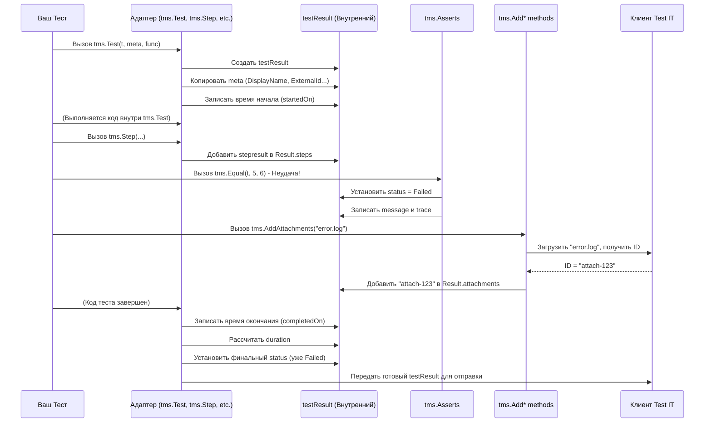

# Chapter 7: Результат Теста


В [предыдущей главе](06_методы_добавления_информации_.md) мы узнали, как добавлять к нашим тестам и шагам дополнительный контекст — сообщения, ссылки и вложения — с помощью методов `tms.AddMessage`, `tms.AddLinks` и `tms.AddAttachments`. Теперь у нас есть все кусочки головоломки: метаданные теста, шаги, результаты подготовки и завершения (фикстуры), исходы проверок (ассертов) и дополнительная информация. Но как все это собирается вместе перед отправкой в Test IT?

Именно здесь на сцену выходит **Результат Теста** (`testResult`). Это внутренняя структура данных, которую адаптер `adapters-go` использует как главный "сборник" для всей информации о конкретном запуске теста.

Представьте, что вы только что завершили важную миссию (выполнили автотест). Вам нужно составить **итоговый отчет**. В этот отчет войдет:
*   **Название миссии и цель:** (Метаданные: `DisplayName`, `Description`)
*   **Исход:** Успех, провал или отмена? (Статус: `Passed`, `Failed`, `Skipped`)
*   **Время начала и окончания:** Сколько времени заняла миссия? (Длительность)
*   **Ключевые этапы:** Описание каждого шага миссии и их результат. (Шаги `tms.Step`)
*   **Подготовка:** Что делали перед основной фазой? (Фикстура `tms.BeforeTest`)
*   **Завершение:** Что сделали после? (Фикстура `tms.AfterTest`)
*   **Проблемы:** Подробное описание возникших ошибок и где они произошли. (Сообщения и трассировка стека от ассертов или паники)
*   **Приложения:** Фотографии, карты, записи переговоров. (Вложения `tms.AddAttachments`)
*   **Связанные документы:** Ссылки на другие отчеты или инструкции. (Ссылки `tms.AddLinks`)

`testResult` в `adapters-go` — это и есть такой шаблон отчета. Адаптер методично заполняет его по ходу выполнения теста, собирая все детали воедино. Когда тест завершается, этот заполненный "отчет" (`testResult`) готов к отправке.

В этой главе мы разберемся:
*   Что такое структура `testResult`?
*   Какую информацию она хранит?
*   Как она заполняется во время выполнения теста?
*   Какова ее роль в отправке данных в Test IT?

## Структура `testResult`: Шаблон Отчета

`testResult` — это Go-структура, определенная внутри адаптера (в файле `testresult.go`). Она не видна напрямую пользователю, но является сердцем сбора данных. Давайте посмотрим на ее основные "поля" (упрощенно):

```go
// Упрощенная структура из файла testresult.go
type testResult struct {
	// --- Информация об автотесте (из метаданных tms.TestMetadata) ---
	externalId  string   // Уникальный ID автотеста в Test IT
	displayName string   // Отображаемое имя теста
	title       string   // Заголовок автотеста
	description string   // Описание автотеста
	labels      []string // Метки (теги) автотеста
	links       []Link   // Ссылки в карточке автотеста
	workItemIds []string // Связанные тест-кейсы в Test IT
	className   string   // Имя "класса" или группы
	nameSpace   string   // "Пространство имен" (обычно имя файла)
	parameters  map[string]interface{} // Параметры теста

	// --- Результаты выполнения ---
	status      string    // Итоговый статус: Passed, Failed, Skipped
	message     string    // Сообщение (часто от ошибки или tms.AddMessage)
	trace       string    // Трассировка стека при ошибке
	startedOn   time.Time // Время начала выполнения
	completedOn time.Time // Время завершения
	duration    int64     // Длительность выполнения (в миллисекундах)

	// --- Шаги и Фикстуры ---
	setups    []stepresult // Результаты шагов из tms.BeforeTest
	steps     []stepresult // Результаты шагов из tms.Step (внутри tms.Test)
	teardowns []stepresult // Результаты шагов из tms.AfterTest

	// --- Дополнительная информация результата ---
	resultLinks []Link   // Ссылки, добавленные через tms.AddLinks
	attachments []string // ID вложений, добавленных через tms.AddAttachments
}

// stepresult - это похожая структура для хранения данных шага или фикстуры
// Link - структура для ссылок
```

**Ключевые поля:**

*   **Информация об автотесте:** Сюда копируются данные, которые вы передали в `tms.TestMetadata` при вызове `tms.Test` (см. [Глава 2: Запуск Теста и Метаданные](02_запуск_теста_и_метаданные_.md)). Эта информация используется для идентификации и описания самого автотеста в Test IT.
*   **Результаты выполнения:** Самое главное — статус (`Passed`, `Failed`, `Skipped`), время начала/окончания и длительность. Если тест упал, поля `message` и `trace` содержат информацию об ошибке, полученную от [ассертов](05_проверки__ассерты__.md) или паники.
*   **Шаги и Фикстуры:** Хранятся срезы (slices) с результатами каждого шага, выполненного в рамках [фикстур](04_подготовка_и_завершение__фикстуры__.md) (`setups`, `teardowns`) и основной логики теста (`steps` из [Глава 3: Шаги Теста](03_шаги_теста_.md)). Каждый элемент этих срезов (`stepresult`) содержит имя, статус, длительность и другие детали конкретного шага.
*   **Дополнительная информация результата:** Здесь хранятся ссылки (`resultLinks`) и *идентификаторы* вложений (`attachments`), добавленные с помощью методов из [Глава 6: Методы Добавления Информации](06_методы_добавления_информации_.md).

Эта структура агрегирует абсолютно все, что адаптер знает о только что прошедшем тесте.

## Жизненный цикл `testResult`: Заполнение Отчета

Как и когда заполняется этот "отчет"? Процесс идет шаг за шагом во время выполнения вашего теста:

1.  **Создание:** Когда вы вызываете `tms.Test`, первым делом создается пустой экземпляр `testResult`.
2.  **Копирование Метаданных:** Информация из переданной вами `TestMetadata` (имя, описание, связи и т.д.) копируется в соответствующие поля `testResult`. Если какие-то поля (вроде `externalId` или `displayName`) не были заданы, они генерируются автоматически.
3.  **Запись `BeforeTest`:** Если вы использовали `tms.BeforeTest`, его результат (в виде `stepresult`) добавляется в срез `setups`.
4.  **Запись Шагов (`tms.Step`):** Каждый раз, когда внутри `tms.Test` выполняется `tms.Step`, его результат (в виде `stepresult`) добавляется в срез `steps`.
5.  **Обновление Статуса и Ошибок:** Если [ассерт](05_проверки__ассерты__.md) (например, `tms.False`) не выполняется или происходит паника:
    *   Статус текущего шага (если есть) и/или всего `testResult` устанавливается в `Failed`.
    *   Сообщение об ошибке и трассировка стека записываются в поля `message` и `trace` соответствующего шага и/или `testResult`.
6.  **Добавление Информации:**
    *   Вызов `tms.AddMessage` добавляет текст в `message`.
    *   Вызов `tms.AddLinks` добавляет `Link` в `resultLinks`.
    *   Вызов `tms.AddAttachments` загружает файл, получает его ID от Test IT (через [Клиент Test IT](08_клиент_test_it_.md)) и добавляет этот ID в `attachments` текущего шага или `testResult`.
7.  **Фиксация Времени и Статуса:** Когда `tms.Test` завершает выполнение вашей тестовой функции (через механизм `defer`), он:
    *   Записывает время окончания (`completedOn`).
    *   Вычисляет общую длительность (`duration`).
    *   Определяет финальный статус (`status`), учитывая результат ассертов, паники и статус `t.Failed()`.
8.  **Запись `AfterTest`:** Если вы использовали `tms.AfterTest`, его результат (в виде `stepresult`) добавляется в срез `teardowns`. **Важно:** Это часто происходит уже *после* начальной отправки результата теста, поэтому клиент выполняет *обновление* данных в Test IT.
9.  **Готовность к отправке:** Теперь объект `testResult` полностью заполнен и готов для передачи следующему компоненту — клиенту Test IT.

Представим этот процесс на диаграмме:



## Роль `testResult` в Отправке Данных

Заполненный `testResult` — это "сырье", которое содержит всю информацию в удобном для адаптера формате. Но API Test IT ожидает данные в другом, специфическом JSON-формате.

Здесь происходит два ключевых этапа:

1.  **Передача Клиенту:** Адаптер (в конце `tms.Test` и `tms.AfterTest`) передает готовый объект `testResult` функциям [Клиента Test IT](08_клиент_test_it_.md), таким как `client.writeTest` и `client.updateTestResult`.
2.  **Конвертация:** Внутри клиента, перед отправкой HTTPS-запроса на сервер Test IT, специальные функции-конвертеры (находящиеся в `converter.go`) преобразуют структуру `testResult` (и вложенные `stepresult`) в модели данных, ожидаемые API Test IT (например, `AutoTestResultsForTestRunModel`, `AttachmentPutModelAutoTestStepResultsModel`). Эти функции рекурсивно обходят шаги и фикстуры, преобразуя каждый элемент.

То есть, `testResult` — это промежуточное, внутреннее представление результата теста. Он не отправляется в Test IT "как есть", а служит удобным форматом для сбора данных, прежде чем они будут преобразованы и отправлены клиентом. Это как черновик вашего отчета о миссии, который затем перепечатывают на официальный бланк перед подачей начальству.

## Заглянем в Код

Давайте посмотрим на фрагменты кода, иллюстрирующие `testResult`.

**1. Определение структуры (`testresult.go`):**

```go
// Файл: testresult.go (упрощено)
package tms

import (
	"time"
	"golang.org/x/exp/slog" // Для логирования внутри адаптера
)

type testResult struct {
	// ... (поля, описанные выше) ...
	externalId  string
	displayName string
	// ...
	status      string
	message     string
	trace       string
	startedOn   time.Time
	completedOn time.Time
	duration    int64
	steps       []stepresult
	setups      []stepresult
	teardowns   []stepresult
	attachments []string
	// ... и другие поля ...
}

// Метод для добавления статуса (используется ассертами и при панике)
func (tr *testResult) addStatus(v string) {
	// Если статус уже Failed, он таким и останется
	if tr.status != failed {
		tr.status = v
	}
}

// Метод для добавления шага
func (tr *testResult) addStep(step stepresult) {
	tr.steps = append(tr.steps, step)
}

// Метод для добавления фикстуры "Before"
func (tr *testResult) addBefore(step stepresult) {
	tr.setups = append(tr.setups, step)
}

// Метод для добавления фикстуры "After"
func (tr *testResult) addAfter(step stepresult) {
	tr.teardowns = append(tr.teardowns, step)
}

// Метод для добавления ID вложения
func (tr *testResult) addAttachments(a string) {
	tr.attachments = append(tr.attachments, a)
}

// Метод для добавления сообщения об ошибке
func (tr *testResult) addMessage(message string) {
	tr.message = message // Перезаписывает предыдущее
}

// Метод для добавления трейса ошибки
func (tr *testResult) addTrace(trace string) {
	tr.trace = trace // Перезаписывает предыдущий
}

// Метод для отправки начального результата (вызывается из tms.Test)
func (tr *testResult) write() string {
	const op = "tms.testResult.write"
	// Вызов клиента для отправки данных
	id, err := client.writeTest(*tr) // Передаем *tr (копию testResult) клиенту
	if err != nil {
		logger.Error("ошибка записи результата теста", "error", err, slog.String("op", op))
	}
	return id // Возвращаем ID созданного результата в Test IT
}

// Метод для обновления результата (вызывается из tms.AfterTest)
func (tr *testResult) update(resultID string) {
	const op = "tms.testResult.update"
	// Сначала обновляем информацию об автотесте (если нужно)
	err := client.updateTest(*tr)
	if err != nil {
		logger.Error("не удалось обновить тест", "error", err, slog.String("op", op))
	}

	// Затем обновляем сам результат теста (добавляем teardowns, меняем статус)
	err = client.updateTestResult(resultID, *tr)
	if err != nil {
		logger.Error("не удалось обновить результат теста", "error", err, slog.String("op", op))
	}
}
```
Мы видим саму структуру и методы, которые используются другими частями адаптера для ее наполнения (`addStep`, `addStatus`, `addAttachments` и т.д.). Методы `write` и `update` делегируют работу [Клиенту Test IT](08_клиент_test_it_.md).

**2. Использование в `client.writeTest` (`client.go`):**

```go
// Файл: client.go (фрагмент)
package tms

// ... импорты ...

// Принимает объект testResult и отправляет данные в Test IT
func (c *tmsClient) writeTest(test testResult) (string, error) { // <--- Принимает testResult
	const op = "tmsClient.writeTest"
	logger := logger.With("op", op)

	ctx := context.WithValue(context.Background(), tmsclient.ContextAPIKeys, /* ... ключи API ... */)

	// --- Поиск или Создание/Обновление Автотеста ---
	// Использует test.externalId, test.displayName и др. поля testResult
	// ... (логика поиска autotestID по test.externalId) ...
	// ... (логика создания или обновления автотеста с использованием данных из test) ...

	// --- Связывание с WorkItems ---
	// Использует test.workItemIds
	// ... (логика связывания) ...

	// --- Отправка Результата Теста ---
	// 1. Конвертация testResult в модель API
	rr, err := testToResultModel(test, c.cfg.ConfigurationId) // <--- Конвертер использует test
	if err != nil {
		logger.Error("не удалось конвертировать тест в модель результата", "error", err, slog.String("op", op))
		return "", fmt.Errorf("%s: ...", op, err)
	}

	// 2. Отправка запроса к Test IT API
	logger.Debug("загрузка результата в тест-ран", "request", rr)
	ids, r, err := c.client.TestRunsAPI.SetAutoTestResultsForTestRun(ctx, c.cfg.TestRunId).
		AutoTestResultsForTestRunModel(rr). // <--- Передаем конвертированную модель
		Execute()

	// ... (обработка ошибок) ...

	return ids[0], nil // Возвращаем ID результата
}
```
Этот фрагмент показывает, как функция клиента `writeTest` принимает `testResult`, использует его поля для различных операций (поиск, обновление автотеста), вызывает конвертер `testToResultModel` для преобразования `testResult` и затем отправляет преобразованные данные в Test IT.

## Заключение

В этой главе мы познакомились с `testResult` — ключевой внутренней структурой `adapters-go`. Мы поняли, что она действует как центральный "сборник" или "отчет", куда стекается вся информация о прохождении теста: метаданные, шаги, фикстуры, статус, ошибки, вложения и ссылки. Мы увидели, как различные функции адаптера (`tms.Test`, `tms.Step`, ассерты, `tms.Add*`) постепенно заполняют этот отчет.

`testResult` является мостом между выполнением вашего теста и отправкой данных в Test IT. Хотя вы не взаимодействуете с ней напрямую, понимание ее роли помогает лучше представить, как адаптер собирает и организует данные перед тем, как передать их следующему важному компоненту.

Теперь, когда у нас есть готовый, заполненный "отчет" (`testResult`), кто же отвечает за его финальную обработку (конвертацию) и непосредственную отправку по сети в Test IT TMS?

Об этом мы поговорим в следующей, заключительной главе основного руководства: [Клиент Test IT](08_клиент_test_it_.md).

---

Generated by [AI Codebase Knowledge Builder](https://github.com/The-Pocket/Tutorial-Codebase-Knowledge)