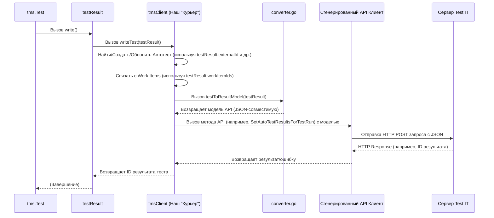

# Chapter 8: Клиент Test IT


В [предыдущей главе](07_результат_теста_.md) мы увидели, как `testResult` собирает всю информацию о выполнении теста в единый "отчет". Теперь у нас есть готовый, детально заполненный документ. Но кто же возьмет этот отчет и доставит его по назначению — в систему Test IT TMS? Кто будет общаться с этой системой, обновлять данные об автотестах, загружать файлы?

Именно для этого в `adapters-go` существует **Клиент Test IT** (`tmsClient`).

Представьте, что `testResult` — это посылка, которую вы подготовили (ваш отчет о тесте). Пакет `adapters-go` — это вся почтовая служба. А `tmsClient` — это **курьер** внутри этой службы. Его задача — взять вашу посылку (`testResult`), убедиться, что она правильно упакована и все поля на ней заполнены (используя [конвертер](08_клиент_test_it_.md#как-это-работает-под-капотом-конвертация)), а затем доставить ее по правильному адресу (URL из [Конфигурации Адаптера](01_конфигурация_адаптера_.md)), используя ваш специальный пропуск (Токен из [Конфигурации Адаптера](01_конфигурация_адаптера_.md)).

Этот "курьер" отвечает за **всё** взаимодействие с сервером Test IT. Он — связующее звено между вашими тестами на Go и системой управления тестированием.

В этой главе мы узнаем:
*   Каковы основные задачи Клиента Test IT (`tmsClient`)?
*   Как он использует конфигурацию и результат теста?
*   Нужно ли вам взаимодействовать с ним напрямую?
*   Как он работает "под капотом"?

## Задачи Клиента Test IT

`tmsClient` — это внутренний компонент адаптера, который берет на себя всю черновую работу по общению с API Test IT. Его основные обязанности:

1.  **Подключение к Test IT:** Используя `url` и `privateToken` из [Конфигурации Адаптера](01_конфигурация_адаптера_.md), клиент устанавливает соединение с вашим экземпляром Test IT.
2.  **Работа с Автотестами:**
    *   **Поиск:** Перед отправкой результатов он ищет в Test IT автотест по его `externalId` (который вы задали в [Метаданных Теста](02_запуск_теста_и_метаданные_.md) или который был сгенерирован автоматически).
    *   **Создание:** Если автотест не найден, а в конфигурации разрешено (`automaticCreationTestCases: true`), клиент создает новый автотест в Test IT, используя все метаданные из `testResult`.
    *   **Обновление:** Если автотест найден, клиент обновляет его информацию (имя, описание, шаги, ссылки и т.д.), чтобы она соответствовала последней версии вашего кода.
3.  **Отправка Результатов:** Клиент берет [Результат Теста](07_результат_теста_.md) (`testResult`), преобразует его в нужный формат и отправляет в указанный `testRunId` (из [Конфигурации Адаптера](01_конфигурация_адаптера_.md)).
4.  **Загрузка Вложений:** Когда вы вызываете `tms.AddAttachments`, именно клиент отвечает за чтение файла, отправку его содержимого на сервер Test IT и получение уникального ID этого вложения.
5.  **Связывание с Work Items:** Клиент обрабатывает поле `workItemIds` из [Метаданных Теста](02_запуск_теста_и_метаданные_.md), чтобы связать ваш автотест с соответствующими ручными тест-кейсами или другими рабочими элементами в Test IT.
6.  **Создание Тест-Рана (Режим 2):** Если в конфигурации задан `adapterMode: "2"`, клиент автоматически создает новый тест-ран перед началом выполнения тестов.

По сути, `tmsClient` — это мозг и руки адаптера, когда дело доходит до реального общения с Test IT.

## Нужно ли вам использовать `tmsClient` напрямую?

**Нет, почти никогда.**

Адаптер `adapters-go` спроектирован так, чтобы скрыть сложность прямого взаимодействия с API. Вы работаете с более высокоуровневыми функциями, такими как:
*   `tms.Test`
*   `tms.Step`
*   `tms.BeforeTest`, `tms.AfterTest`
*   `tms.AddAttachments`, `tms.AddLinks`, `tms.AddMessage`
*   Ассерты (`tms.Equal`, `tms.True` и т.д.)

Все эти функции *внутри себя* используют `tmsClient` для выполнения необходимых действий. Например:
*   Когда `tms.Test` завершает работу, он вызывает метод `testResult.write()`, который, в свою очередь, вызывает `client.writeTest(testResult)` для отправки данных.
*   Когда `tms.AddAttachments` вызывается, она вызывает `client.writeAttachments(paths...)` для загрузки файлов.

Вам не нужно думать о том, как именно создать HTTP-запрос, как его авторизовать или как правильно сформировать JSON. "Курьер" (`tmsClient`) делает это за вас. Вы просто передаете ему "посылку" (`testResult`) или просите выполнить специфическое поручение (загрузить файл).

Единственный момент, когда вы косвенно влияете на работу клиента — это через [Конфигурацию Адаптера](01_конфигурация_адаптера_.md), где вы указываете адрес, токен и другие параметры, которые клиент будет использовать.

## Как это работает "под капотом"?

Давайте разберем жизненный цикл клиента и процесс отправки данных.

### 1. Инициализация Клиента

При запуске ваших тестов (еще до их фактического выполнения) срабатывает функция `init()` в пакете `tms` (файл `init.go`).

```go
// Файл: init.go (упрощенный фрагмент)
package tms

import (
	"github.com/jtolds/gls"
	"github.com/testit-tms/adapters-go/config"
	// ... другие импорты ...
)

var (
	cfg    *config.Config // Загруженная конфигурация
	client *tmsClient     // Наш главный клиент!
	// ... другие глобальные переменные (логгер, контекст) ...
)

func init() {
	// Шаг 1: Загружаем конфигурацию
	cfg = config.MustLoad()
	// ... настройка логирования ...

	// Шаг 2: Создаем экземпляр tmsClient, передавая ему конфигурацию
	client = newClient(*cfg) // <--- Создание курьера

	// Шаг 3: Если режим 2, просим клиента создать тест-ран
	if cfg.AdapterMode == "2" {
		callCreateTestRun(client, cfg) // Обновляет cfg.TestRunId
	}
	// ... другая инициализация (контекст gls) ...
}
```
На этом этапе "курьер" (`tmsClient`) создан и готов к работе. Функция `newClient` (из `client.go`) настраивает подключение к API Test IT, используя `url` и параметры валидации сертификата из `cfg`. Она использует автоматически сгенерированный клиент API (`github.com/testit-tms/api-client-golang`) для низкоуровневого общения.

```go
// Файл: client.go (упрощенный newClient)
package tms

import (
	// ... импорты ...
	"github.com/testit-tms/adapters-go/config"
	tmsclient "github.com/testit-tms/api-client-golang/v3" // Сгенерированный API-клиент
)

type tmsClient struct {
	cfg    config.Config
	client *tmsclient.APIClient // Экземпляр сгенерированного клиента
}

// Создает наш внутренний tmsClient
func newClient(cfg config.Config) *tmsClient {
	// ... (определение схемы http/https) ...
	// Настройка HTTP клиента (пропуск валидации сертификата, если нужно)
	tr := &http.Transport{
		TLSClientConfig: &tls.Config{InsecureSkipVerify: cfg.CertValidation},
	}
	hc := &http.Client{Transport: tr}

	// Конфигурация для сгенерированного API клиента
	configuration := tmsclient.NewConfiguration()
	configuration.Host = // ... (извлечение хоста из cfg.Url) ...
	configuration.Scheme = // ... (схема http/https) ...
	configuration.HTTPClient = hc // Используем наш настроенный HTTP клиент

	// Создание экземпляра сгенерированного API клиента
	apiClient := tmsclient.NewAPIClient(configuration)

	// Возвращаем наш tmsClient, который содержит сгенерированный apiClient
	return &tmsClient{
		client: apiClient, // Сохраняем сгенерированный клиент
		cfg:    cfg,       // Сохраняем конфигурацию
	}
}
```

### 2. Отправка Результата Теста (`writeTest`)

Когда `tms.Test` завершается, он вызывает `testResult.write()`, которая вызывает `client.writeTest(testResult)`.



Метод `client.writeTest` (из `client.go`) выполняет несколько шагов:
1.  **Авторизация:** Устанавливает заголовок авторизации с токеном (`PrivateToken`) для всех последующих запросов к API.
2.  **Поиск/Создание/Обновление Автотеста:** Использует `externalId` из `testResult` для поиска автотеста через API. Если не найден, создает новый (`CreateAutoTest`). Если найден, обновляет его (`UpdateAutoTest`), используя метаданные из `testResult`.
3.  **Связывание:** Использует `workItemIds` из `testResult` для вызова API (`LinkAutoTestToWorkItem`) и связывания автотеста с тест-кейсами.
4.  **Конвертация:** Вызывает функцию `testToResultModel` (из `converter.go`), которая преобразует структуру `testResult` в `AutoTestResultsForTestRunModel` — модель, которую ожидает API Test IT.
5.  **Отправка Результата:** Вызывает метод `SetAutoTestResultsForTestRun` сгенерированного API клиента, передавая ему сконвертированную модель. Этот вызов отправляет фактический HTTP-запрос на сервер Test IT.
6.  **Обработка Ответа:** Получает ответ от сервера (например, ID созданного результата теста) и возвращает его.

Вот очень упрощенный фрагмент `client.writeTest`:

```go
// Файл: client.go (упрощенный writeTest)
func (c *tmsClient) writeTest(test testResult) (string, error) {
	// ... (логгер, установка токена авторизации в контекст) ...

	// --- Шаг 2: Поиск/Создание/Обновление Автотеста ---
	autotestID := c.findOrCreateOrUpdateAutotest(ctx, test)
	// ... обработка ошибок ...

	// --- Шаг 3: Связывание с WorkItems ---
	c.linkWorkItems(ctx, autotestID, test.workItemIds)
	// ... обработка ошибок ...

	// --- Шаг 4: Конвертация Результата ---
	apiModel, err := testToResultModel(test, c.cfg.ConfigurationId) // Вызов конвертера
	if err != nil { /* ... обработка ошибки ... */ }

	// --- Шаг 5: Отправка Результата ---
	ids, response, err := c.client.TestRunsAPI.
		SetAutoTestResultsForTestRun(ctx, c.cfg.TestRunId). // Вызов API
		AutoTestResultsForTestRunModel(apiModel).        // Передача модели
		Execute()
	if err != nil { /* ... обработка ошибки ответа сервера ... */ }

	// --- Шаг 6: Возврат ID результата ---
	return ids[0], nil
}
```

### 3. Конвертация (`converter.go`)

Файл `converter.go` содержит функции, которые берут внутренние структуры адаптера (`testResult`, `stepresult`, `Link`) и преобразуют их в структуры, сгенерированные клиентом API (`AutoTestResultsForTestRunModel`, `AttachmentPutModelAutoTestStepResultsModel`, `LinkPostModel` и т.д.).

```go
// Файл: converter.go (упрощенный пример конвертации testResult)
package tms

import (
	tmsclient "github.com/testit-tms/api-client-golang/v3" // Модели API
	// ... другие импорты ...
)

// Конвертирует наш testResult в модель, ожидаемую API
func testToResultModel(test testResult, confID string) ([]tmsclient.AutoTestResultsForTestRunModel, error) {
	// Определяем статус (Outcome) для API
	outcome, err := tmsclient.NewAvailableTestResultOutcomeFromValue(test.status)
	if err != nil { /* ... ошибка ... */ }

	// Создаем модель API
	req := tmsclient.NewAutoTestResultsForTestRunModel(confID, test.externalId, *outcome)

	// Копируем простые поля
	req.SetDuration(test.duration)
	req.SetMessage(test.message)
	req.SetTraces(test.trace)
	req.SetStartedOn(test.startedOn)
	req.SetCompletedOn(test.completedOn)

	// Конвертируем вложенные шаги (рекурсивно)
	if len(test.steps) != 0 {
		apiSteps, err := stepToAttachmentPutModelAutoTestStepResultsModel(test.steps)
		if err != nil { /* ... ошибка ... */ }
		req.SetStepResults(apiSteps) // Устанавливаем сконвертированные шаги
	}

	// Конвертируем фикстуры Setup (аналогично шагам)
	// ... req.SetSetupResults(...) ...

	// Конвертируем ссылки
	// ... req.SetLinks(...) ...

	// Конвертируем вложения (просто ID)
	if len(test.attachments) != 0 {
		apiAttachs := make([]tmsclient.AttachmentPutModel, 0, len(test.attachments))
		for _, attachID := range test.attachments {
			a := tmsclient.NewAttachmentPutModel(attachID) // Модель API для вложения по ID
			apiAttachs = append(apiAttachs, *a)
		}
		req.SetAttachments(apiAttachs)
	}

	// Конвертируем параметры
	// ... req.SetParameters(...) ...

	return []tmsclient.AutoTestResultsForTestRunModel{*req}, nil
}

// Рекурсивная функция для конвертации шагов (stepresult -> API модель)
func stepToAttachmentPutModelAutoTestStepResultsModel(s []stepresult) ([]tmsclient.AttachmentPutModelAutoTestStepResultsModel, error) {
	// ... (похожая логика конвертации для каждого шага, включая его вложения и дочерние шаги) ...
}
```
Эта конвертация необходима, чтобы наш внутренний "черновик отчета" (`testResult`) превратился в "официальный бланк", понятный серверу Test IT.

### 4. Загрузка Вложений (`writeAttachments`)

Когда вызывается `tms.AddAttachments`, она обращается к `client.writeAttachments`.

```go
// Файл: client.go (упрощенный writeAttachments)
func (c *tmsClient) writeAttachments(paths ...string) []string {
	// ... (логгер, установка токена в контекст) ...
	attachmentIDs := make([]string, 0, len(paths))

	for _, path := range paths {
		// Открываем файл
		file, err := os.Open(path)
		if err != nil { /* ... ошибка ... */ continue }

		// Вызываем метод API для загрузки файла
		resp, response, err := c.client.AttachmentsAPI.
			ApiV2AttachmentsPost(ctx). // Метод API для загрузки
			File(file).                // Передаем открытый файл
			Execute()
		file.Close() // Не забываем закрыть файл

		if err != nil { /* ... ошибка от сервера ... */ continue }

		// Сохраняем ID, возвращенный сервером
		attachmentIDs = append(attachmentIDs, resp.Id)
	}
	return attachmentIDs // Возвращаем массив ID загруженных файлов
}
```
Здесь клиент напрямую использует метод `ApiV2AttachmentsPost` сгенерированного API-клиента для отправки содержимого файла на сервер и получает в ответ ID.

## Заключение

В этой заключительной главе мы познакомились с Клиентом Test IT (`tmsClient`) — невидимым, но незаменимым "курьером" внутри адаптера `adapters-go`. Мы узнали, что именно он отвечает за всю реальную коммуникацию с сервером Test IT: подключение, авторизацию, поиск/создание/обновление автотестов, отправку результатов, загрузку вложений и связывание с рабочими элементами.

Мы поняли, что нам, как пользователям адаптера, не нужно напрямую вызывать методы клиента. Вместо этого мы используем удобные функции (`tms.Test`, `tms.Step`, `tms.AddAttachments` и др.), которые делегируют работу клиенту. Клиент, в свою очередь, использует [Конфигурацию Адаптера](01_конфигурация_адаптера_.md) для подключения и [Результат Теста](07_результат_теста_.md) как источник данных, преобразуя его с помощью конвертера (`converter.go`) перед отправкой через сгенерированный API-клиент.

Понимание роли `tmsClient` завершает нашу картину работы адаптера `adapters-go`. Теперь вы знаете не только, *как использовать* его для интеграции ваших Go-тестов с Test IT, но и *как он работает внутри*, от конфигурации до финальной отправки данных. Надеемся, это руководство поможет вам эффективно использовать `adapters-go` в ваших проектах!

---

Generated by [AI Codebase Knowledge Builder](https://github.com/The-Pocket/Tutorial-Codebase-Knowledge)