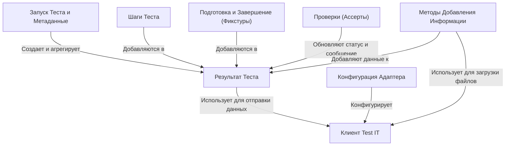

# Tutorial: adapters-go

Этот проект представляет собой *адаптер* для Go, который позволяет легко интегрировать ваши автоматические тесты с системой управления тестированием **Test IT TMS**.
Он оборачивает стандартные Go-тесты, позволяя вам добавлять *метаданные* (имена, описания, связи), разбивать тесты на *шаги* и автоматически отправлять **детальные результаты**, включая статус, ошибки, вложения и логи, в ваш Test IT проект.
Это помогает централизованно отслеживать выполнение автотестов и их связь с тест-кейсами.

**Source Repository:** [https://github.com/testit-tms/adapters-go](https://github.com/testit-tms/adapters-go)

## Chapters

1. [Конфигурация Адаптера
](01_конфигурация_адаптера_.md)
2. [Запуск Теста и Метаданные
](02_запуск_теста_и_метаданные_.md)
3. [Шаги Теста
](03_шаги_теста_.md)
4. [Подготовка и Завершение (Фикстуры)
](04_подготовка_и_завершение__фикстуры__.md)
5. [Проверки (Ассерты)
](05_проверки__ассерты__.md)
6. [Методы Добавления Информации
](06_методы_добавления_информации_.md)
7. [Результат Теста
](07_результат_теста_.md)
8. [Клиент Test IT
](08_клиент_test_it_.md)

---

Generated by [AI Codebase Knowledge Builder](https://github.com/The-Pocket/Tutorial-Codebase-Knowledge)